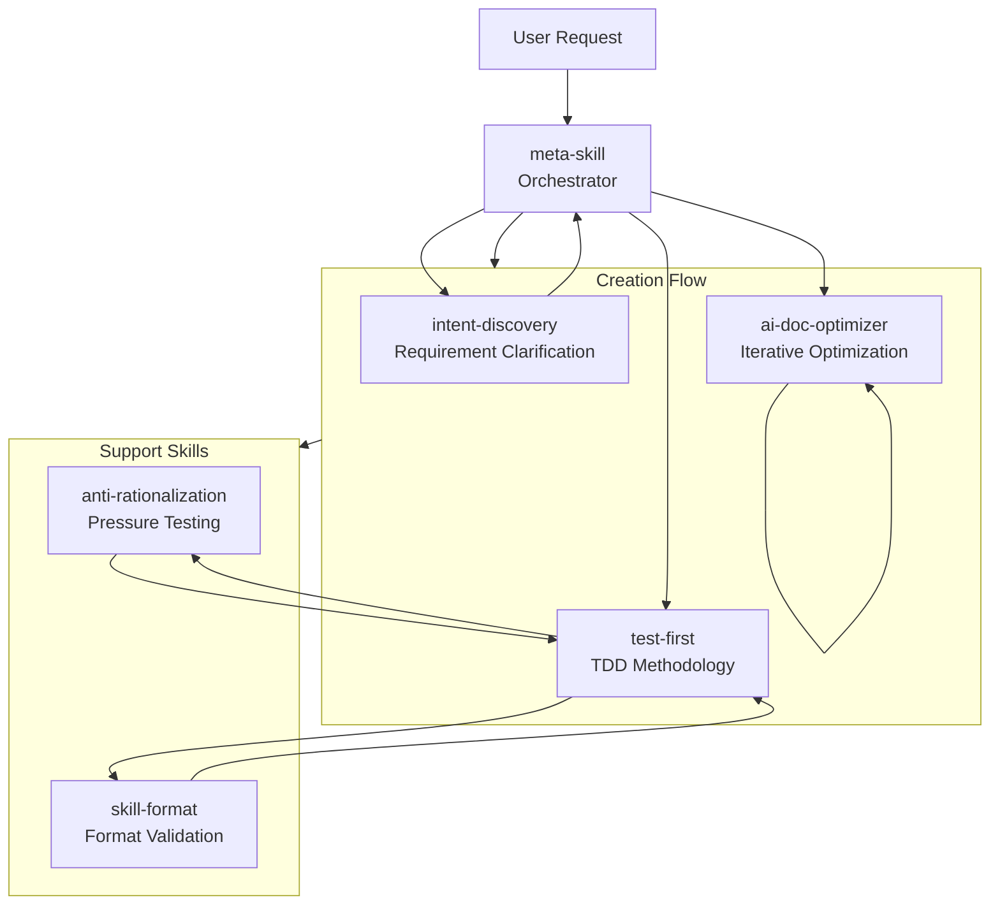

# Meta Skill

**Create custom AI skills with guaranteed completeness and optimized retrieval.** Meta-skill uses **TDD + Anti-Rationalization Pressure Testing + Blind Comparison** to ensure skill completeness, and **redundancy removal + ambiguity clarification + progressive disclosure** to maximize AI retrieval efficiency.

[中文文档](README_CN.md)

---

## Quick Start: Create Your First Skill

```bash
# In Qwen Code or Claude Code, simply ask:
"Create a skill for [your requirement]"
```

**Example:**
```
"Create a skill for automatic code review"
"Create a skill for writing unit tests"
"Create a skill for optimizing prompts"
```

Meta-skill will automatically:

**Ensure Completeness:**
1. **TDD** - Write tests first to define expected behavior
2. **Anti-Rationalization Pressure Testing** - Capture and plug loopholes under pressure scenarios
3. **Blind Comparison** - Verify candidate significantly outperforms baseline

**Optimize AI Retrieval:**
4. **Ambiguity Clarification** - Resolve unclear semantics
5. **Redundancy Removal** - Eliminate duplicate content
6. **Progressive Disclosure** - Structure information from simple to complex

7. **Package** as `.skill` file ready to use

---

## Core Philosophy

**Self-Evolution: The meta-skill uses its own pipeline to create and continuously improve skills (including itself) until convergence.**

The `skills/` directory contains the built-in skill library that meta-skill calls during its creation pipeline.

---

## Core Flow

```
Intent Discovery → TDD-Driven (RED-GREEN-REFACTOR + Anti-Rationalization) → Blind Comparison → AI Retrieval Optimization → Package & Deploy
```

| Stage | Skill | Description |
|-------|-------|-------------|
| **Intent Discovery** | `intent-discovery` | Progressive questioning to clarify vague requirements, output `output_dir` and skill type |
| **TDD-Driven** | `test-first` + `anti-rationalization` | **RED**: Design pressure scenarios + capture rationalizations → **GREEN**: Reinforce with persuasion principles + plug loopholes → **REFACTOR**: Re-test until no new rationalizations |
| **Blind Comparison** | `agents/{grader,comparator,analyzer}` | Blind evaluation: candidate vs baseline, verify significantly better than baseline (selection rate>70% AND pass rate improvement>20%) |
| **AI Retrieval Optimization** | `ai-doc-optimizer` | Iterative optimization until convergence (2 consecutive rounds of semantic equivalence or max_iterations=5) |
| **Package & Deploy** | `scripts/package_skill.py` | Generate `.skill` file, validate: <500 lines, Mermaid diagrams, kebab-case naming |

**Anti-Rationalization Integrated into TDD**:
| TDD Stage | Anti-Rationalization Strategy |
|-----------|-------------------------------|
| **RED** | Design ≥3 overlapping pressure scenarios, adversarial testing to capture rationalizations (verbatim recording) |
| **GREEN** | Reinforce with persuasion principles (authority + commitment + social proof), plug loopholes (No exceptions + prohibit each workaround) |
| **REFACTOR** | Re-test validation, discover new rationalizations → continue reinforcing until none remain |

---

## Skill System Architecture

```
┌─────────────────────────────────────────────────────────────┐
│  skills/  (Built-in Skill Library)                          │
│                                                              │
│  ┌──────────────────────────────────────────────────────┐   │
│  │  meta-skill/ (Orchestrator)                          │   │
│  │  - SKILL.md                                          │   │
│  │  - agents/ (grader, analyzer, comparator)            │   │
│  │  - scripts/ (package_skill.py, aggregate_benchmark)  │   │
│  └──────────────────────────────────────────────────────┘   │
│                                                              │
│  ┌──────────────────────────────────────────────────────┐   │
│  │  Sub-skills (Called by meta-skill during pipeline)   │   │
│  │  - intent-discovery/  - test-first/                  │   │
│  │  - anti-rationalization/  - skill-format/            │   │
│  │  - ai-doc-optimizer/                                 │   │
│  └──────────────────────────────────────────────────────┘   │
└─────────────────────────────────────────────────────────────┘
```

**Note**: When creating a NEW skill, output goes to user-specified directory (`~/.qwen/skills/`, `./`, etc.), NOT in `meta-skill/skills/`.

---

## Skill Relationships



---

## Skills

### Built-in Skill Library

These skills work together to create new skills:

| Skill | Role in Skill Creation |
|-------|------------------------|
| `meta-skill` | **Orchestrator** — coordinates the entire skill creation pipeline |
| `intent-discovery` | **Requirement Analyst** — clarifies vague requirements through progressive questioning |
| `test-first` | **TDD Engine** — writes tests before implementation to ensure correctness |
| `anti-rationalization` | **Quality Assurance** — pressure-tests rules to prevent loopholes |
| `skill-format` | **Validator** — ensures SKILL.md follows proper format |
| `ai-doc-optimizer` | **Optimizer** — iteratively refines documentation for AI reading efficiency |

### How Skills Work Together

When you ask meta-skill to create a new skill:

```
User Request → intent-discovery (clarify) → test-first (write tests) 
           → anti-rationalization (pressure-test) → ai-doc-optimizer (refine)
           → skill-format (validate) → .skill file
```

Each sub-skill handles a specific aspect of the creation process, ensuring the final skill is:
- **Well-defined** (clear requirements)
- **Test-covered** (TDD-driven)
- **Robust** (pressure-tested against rationalization)
- **Well-documented** (optimized for AI reading)
- **Properly formatted** (validated format)

---

## Self-Evolution

All skills in `skills/` are created and maintained by the meta-skill pipeline:

```
v0.1: Single monolithic skill (500+ lines, complex)
    ↓ TDD + Split (via meta-skill)
v0.2: Split into focused sub-skills
    ↓ Refactor (via meta-skill)
v0.3: Remove redundancy, clarify ambiguity
    ↓ Converge (via meta-skill)
v1.0: Final optimized version
```

**Key insight**: meta-skill evolves itself and its sub-skills using the same pipeline it orchestrates.

---

## Directory Structure

```
meta-skill/
├── skills/
│   ├── meta-skill/
│   │   ├── SKILL.md
│   │   ├── agents/              # grader.md, analyzer.md, comparator.md
│   │   └── scripts/             # package_skill.py, aggregate_benchmark.py
│   ├── intent-discovery/
│   │   └── SKILL.md
│   ├── test-first/
│   │   ├── SKILL.md
│   │   └── evals/
│   ├── anti-rationalization/
│   │   └── SKILL.md
│   ├── skill-format/
│   │   └── SKILL.md
│   └── ai-doc-optimizer/
│       └── SKILL.md
├── .qwen/
└── README.md
```

**Note**: `skills/` contains meta-skill's built-in skill library. New skills created via meta-skill are placed in user-specified directories (e.g., `~/.qwen/skills/`, `./`), NOT in `meta-skill/skills/`.

---

## Extensions

This project works as a **Claude Code Plugin**, **Qwen Code Extension**, and **Cursor Plugin**.

### Installation

**Claude Code:**
```bash
/plugin marketplace add https://github.com/Z-JaDe/meta-skill
/plugin install meta-skill
```

**Qwen Code:**
```bash
# From remote URL
qwen extensions install https://github.com/Z-JaDe/meta-skill

# Or link local (for development)
qwen extensions link /path/to/meta-skill
```

**Cursor:**
```bash
# Open Cursor → Settings → AI → Plugins → Add Plugin
# Select the .cursor-plugin folder from this repository
```

### Configuration

| Platform | Configuration File |
|----------|-------------------|
| Claude Code | `.claude-plugin/marketplace.json` |
| Qwen Code | `qwen-extension.json` |
| Cursor | `.cursor-plugin/plugin.json` |

---

## License

MIT

---

## Acknowledgments

This project draws inspiration from:

- **Anthropic's `skill-creator`** - Skill creation methodology
- **Superpowers' `writing-skills`** - Skill writing patterns
