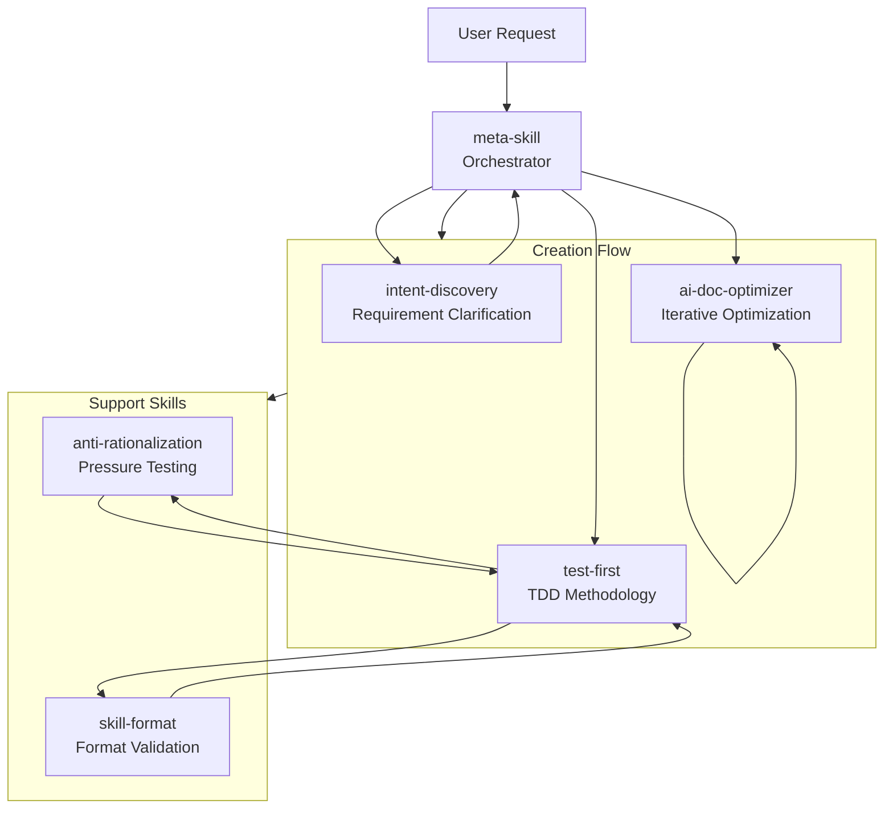

# Meta Skill

A self-evolving skill system: meta-skill orchestrates a **TDD-driven → Blind Comparison → AI Retrieval Optimization** pipeline to iteratively create and evolve skills.

[中文文档](README_CN.md)

---

## Core Philosophy

**Self-Evolution: The meta-skill uses its own pipeline to create and continuously improve skills (including itself) until convergence.**

The `skills/` directory contains the built-in skill library that meta-skill calls during its creation pipeline.

---

## Core Flow

```
Intent Discovery → TDD-Driven (RED-GREEN-REFACTOR + Anti-Rationalization) → Blind Comparison → AI Retrieval Optimization → Package & Deploy
```

| Stage | Skill | Description |
|-------|-------|-------------|
| **Intent Discovery** | `intent-discovery` | Progressive questioning to clarify vague requirements, output `output_dir` and skill type |
| **TDD-Driven** | `test-first` + `anti-rationalization` | **RED**: Design pressure scenarios + capture rationalizations → **GREEN**: Reinforce with persuasion principles + plug loopholes → **REFACTOR**: Re-test until no new rationalizations |
| **Blind Comparison** | `agents/{grader,comparator,analyzer}` | Blind evaluation: candidate vs baseline, verify significantly better than baseline (selection rate>70% AND pass rate improvement>20%) |
| **AI Retrieval Optimization** | `ai-doc-optimizer` | Iterative optimization until convergence (2 consecutive rounds of semantic equivalence or max_iterations=5) |
| **Package & Deploy** | `scripts/package_skill.py` | Generate `.skill` file, validate: <500 lines, Mermaid diagrams, kebab-case naming |

**Anti-Rationalization Integrated into TDD**:
| TDD Stage | Anti-Rationalization Strategy |
|-----------|-------------------------------|
| **RED** | Design ≥3 overlapping pressure scenarios, adversarial testing to capture rationalizations (verbatim recording) |
| **GREEN** | Reinforce with persuasion principles (authority + commitment + social proof), plug loopholes (No exceptions + prohibit each workaround) |
| **REFACTOR** | Re-test validation, discover new rationalizations → continue reinforcing until none remain |

---

## Skill System Architecture

```
┌─────────────────────────────────────────────────────────────┐
│  skills/  (Built-in Skill Library)                          │
│                                                              │
│  ┌──────────────────────────────────────────────────────┐   │
│  │  meta-skill/ (Orchestrator)                          │   │
│  │  - SKILL.md                                          │   │
│  │  - agents/ (grader, analyzer, comparator)            │   │
│  │  - scripts/ (package_skill.py, aggregate_benchmark)  │   │
│  └──────────────────────────────────────────────────────┘   │
│                                                              │
│  ┌──────────────────────────────────────────────────────┐   │
│  │  Sub-skills (Called by meta-skill during pipeline)   │   │
│  │  - intent-discovery/  - test-first/                  │   │
│  │  - anti-rationalization/  - skill-format/            │   │
│  │  - ai-doc-optimizer/                                 │   │
│  └──────────────────────────────────────────────────────┘   │
└─────────────────────────────────────────────────────────────┘
```

**Note**: When creating a NEW skill, output goes to user-specified directory (`~/.qwen/skills/`, `./`, etc.), NOT in `meta-skill/skills/`.

---

## Skill Relationships



---

## Skills

| Skill | Description |
|-------|-------------|
| `meta-skill` | **Orchestrator** — coordinates the skill creation/evolution pipeline |
| `intent-discovery` | Clarify vague requirements through progressive questioning |
| `test-first` | TDD methodology: write tests before implementation |
| `anti-rationalization` | Pressure-test rules and plug rationalization loopholes |
| `skill-format` | Format and validate SKILL.md files |
| `ai-doc-optimizer` | Optimize documents for AI reading efficiency through iterative convergence |

---

## Self-Evolution

All skills in `skills/` are created and maintained by the meta-skill pipeline:

```
v0.1: Single monolithic skill (500+ lines, complex)
    ↓ TDD + Split (via meta-skill)
v0.2: Split into focused sub-skills
    ↓ Refactor (via meta-skill)
v0.3: Remove redundancy, clarify ambiguity
    ↓ Converge (via meta-skill)
v1.0: Final optimized version
```

**Key insight**: meta-skill evolves itself and its sub-skills using the same pipeline it orchestrates.

---

## Directory Structure

```
meta-skill/
├── skills/
│   ├── meta-skill/
│   │   ├── SKILL.md
│   │   ├── agents/              # grader.md, analyzer.md, comparator.md
│   │   └── scripts/             # package_skill.py, aggregate_benchmark.py
│   ├── intent-discovery/
│   │   └── SKILL.md
│   ├── test-first/
│   │   ├── SKILL.md
│   │   └── evals/
│   ├── anti-rationalization/
│   │   └── SKILL.md
│   ├── skill-format/
│   │   └── SKILL.md
│   └── ai-doc-optimizer/
│       └── SKILL.md
├── .qwen/
└── README.md
```

**Note**: `skills/` contains meta-skill's built-in skill library. New skills created via meta-skill are placed in user-specified directories (e.g., `~/.qwen/skills/`, `./`), NOT in `meta-skill/skills/`.

---

## Extensions

### Claude Code Plugin

This project is a **Claude Code Plugin** that provides a self-evolving skill system for creating new skills.

**Installation:**
```bash
/plugin marketplace add https://github.com/Z-JaDe/meta-skill
/plugin install meta-skill
```

### Qwen Code Extension

This project is a **Qwen Code Extension** that provides a self-evolving skill system for creating new skills.

**Installation:**
```bash
# From remote URL
qwen extensions install https://github.com/Z-JaDe/meta-skill

# Or link local extension (for development)
qwen extensions link /path/to/meta-skill
```

**Usage:**

Once installed, create a new skill by asking:

```
Create a skill for [your requirement]
```

The meta-skill will automatically orchestrate:
1. **Intent Discovery** - Clarify requirements through progressive questioning
2. **TDD-Driven** - Write tests first, then implement with pressure-testing
3. **Blind Comparison** - Evaluate candidates against baseline
4. **AI Optimization** - Iteratively optimize until convergence
5. **Package & Deploy** - Generate validated `.skill` file

### Configuration Files

| Platform | Configuration File |
|----------|-------------------|
| Claude Code | `.claude-plugin/marketplace.json` |
| Qwen Code | `qwen-extension.json` |

---

## Usage

**To create a new skill:**

```bash
# Trigger meta-skill in Qwen/Claude
"Create a skill for [your requirement]"
```

The meta-skill will:
1. Clarify requirements via `intent-discovery` (including output_dir)
2. Create tests first via `test-first`
3. Pressure-test via `anti-rationalization` (if discipline-enforcing)
4. Optimize docs via `ai-doc-optimizer`
5. Package as `.skill` file to user-specified directory

---

## License

MIT

---

## Acknowledgments

This project draws inspiration from:

- **Anthropic's `skill-creator`** - Skill creation methodology
- **Superpowers' `writing-skills`** - Skill writing patterns
