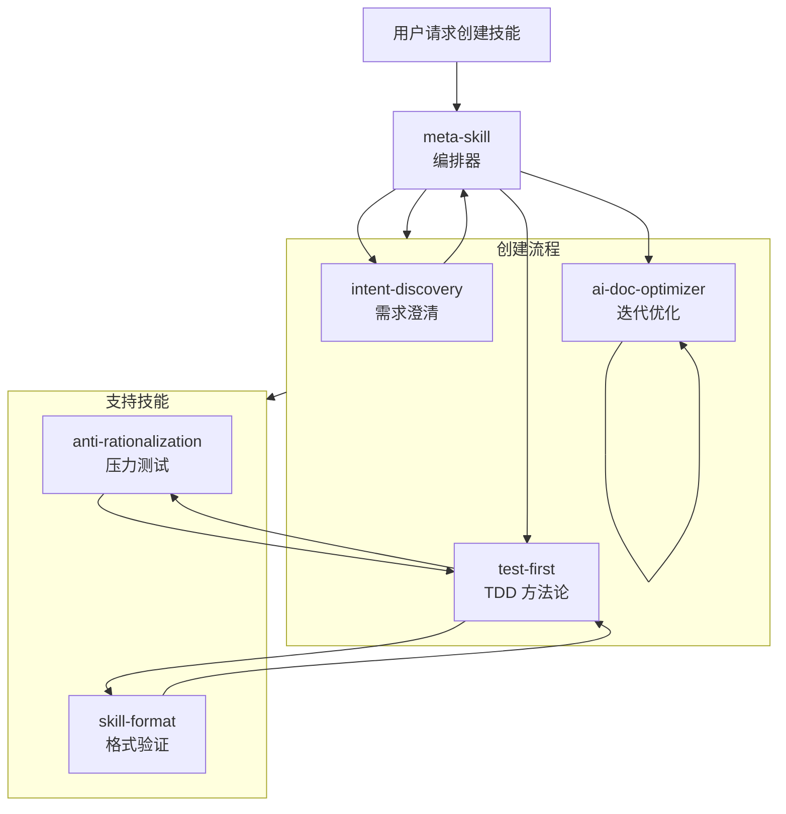

# Meta Skill

A self-evolving skill system: meta-skill orchestrates a pipeline (intent-discovery → TDD → blind comparison → optimization) to iteratively create and evolve skills.

[中文文档](README_CN.md)

---

## Core Philosophy

**Self-Evolution: The meta-skill uses its own pipeline to create and continuously improve skills (including itself) until convergence.**

The `skills/` directory contains the built-in skill library that meta-skill calls during its creation pipeline.

---

## Core Flow

```
CREATE v0.1 → TDD (RED-GREEN-REFACTOR) → BLIND COMPARISON → OPTIMIZE → PACKAGE
```

| Stage | Description |
|-------|-------------|
| **CREATE v0.1** | Create a rough first version quickly (messy is okay) |
| **TDD** | RED: write failing tests → GREEN: make tests pass → REFACTOR: generalize |
| **BLIND COMPARISON** | Compare with-skill vs baseline to verify improvement |
| **OPTIMIZE** | Use ai-doc-optimizer to refine for AI reading efficiency |
| **PACKAGE** | Generate .skill file for deployment |

---

## Skill System Architecture

```
┌─────────────────────────────────────────────────────────────┐
│  skills/  (Built-in Skill Library)                          │
│                                                              │
│  ┌──────────────────────────────────────────────────────┐   │
│  │  meta-skill/ (Orchestrator)                          │   │
│  │  - SKILL.md                                          │   │
│  │  - agents/ (grader, analyzer, comparator)            │   │
│  │  - scripts/ (package_skill.py, aggregate_benchmark)  │   │
│  └──────────────────────────────────────────────────────┘   │
│                                                              │
│  ┌──────────────────────────────────────────────────────┐   │
│  │  Sub-skills (Called by meta-skill during pipeline)   │   │
│  │  - intent-discovery/  - test-first/                  │   │
│  │  - anti-rationalization/  - skill-format/            │   │
│  │  - ai-doc-optimizer/                                 │   │
│  └──────────────────────────────────────────────────────┘   │
└─────────────────────────────────────────────────────────────┘
```

**Note**: When creating a NEW skill, output goes to user-specified directory (`~/.qwen/skills/`, `./`, etc.), NOT in `meta-skill/skills/`.

---

## Skill Relationships



---

## Skills

| Skill | Description |
|-------|-------------|
| `meta-skill` | **Orchestrator** — coordinates the skill creation/evolution pipeline |
| `intent-discovery` | Clarify vague requirements through progressive questioning |
| `test-first` | TDD methodology: write tests before implementation |
| `anti-rationalization` | Pressure-test rules and plug rationalization loopholes |
| `skill-format` | Format and validate SKILL.md files |
| `ai-doc-optimizer` | Optimize documents for AI reading efficiency through iterative convergence |

---

## Self-Evolution

All skills in `skills/` are created and maintained by the meta-skill pipeline:

```
v0.1: Single monolithic skill (500+ lines, complex)
    ↓ TDD + Split (via meta-skill)
v0.2: Split into focused sub-skills
    ↓ Refactor (via meta-skill)
v0.3: Remove redundancy, clarify ambiguity
    ↓ Converge (via meta-skill)
v1.0: Final optimized version
```

**Key insight**: meta-skill evolves itself and its sub-skills using the same pipeline it orchestrates.

---

## Directory Structure

```
meta-skill/
├── skills/
│   ├── meta-skill/
│   │   ├── SKILL.md
│   │   ├── agents/              # grader.md, analyzer.md, comparator.md
│   │   └── scripts/             # package_skill.py, aggregate_benchmark.py
│   ├── intent-discovery/
│   │   └── SKILL.md
│   ├── test-first/
│   │   ├── SKILL.md
│   │   └── evals/
│   ├── anti-rationalization/
│   │   └── SKILL.md
│   ├── skill-format/
│   │   └── SKILL.md
│   └── ai-doc-optimizer/
│       └── SKILL.md
├── .qwen/
└── README.md
```

**Note**: `skills/` contains meta-skill's built-in skill library. New skills created via meta-skill are placed in user-specified directories (e.g., `~/.qwen/skills/`, `./`), NOT in `meta-skill/skills/`.

---

## Usage

**To create a new skill:**

```bash
# Trigger meta-skill in Qwen/Claude
"Create a skill for [your requirement]"
```

The meta-skill will:
1. Clarify requirements via `intent-discovery` (including output_dir)
2. Create tests first via `test-first`
3. Pressure-test via `anti-rationalization` (if discipline-enforcing)
4. Optimize docs via `ai-doc-optimizer`
5. Package as `.skill` file to user-specified directory

---

## License

MIT

---

## Acknowledgments

This project draws inspiration from:

- **Anthropic's `skill-creator`** - Skill creation methodology
- **Superpowers' `writing-skills`** - Skill writing patterns
