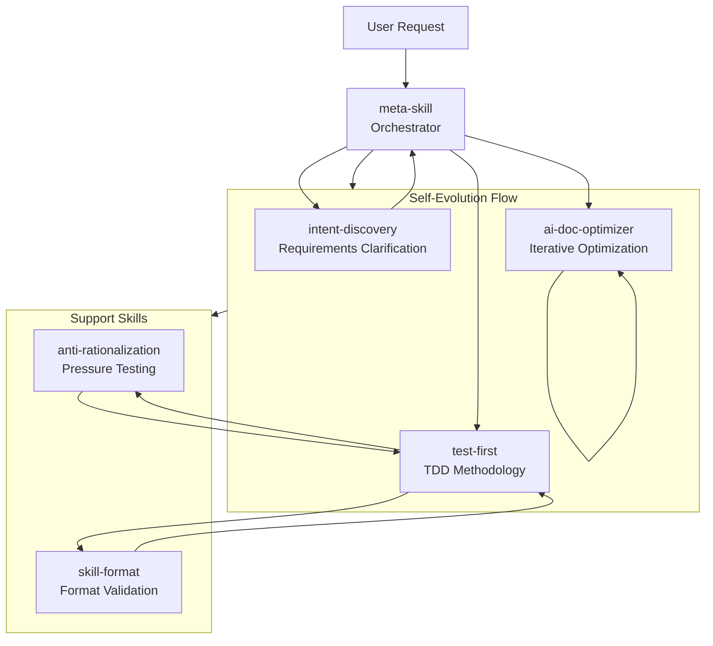

# Meta Skill

A meta-skill system for creating and managing skills.

[中文文档](README_CN.md)

---

## Core Philosophy

**Self-Evolution: Create a messy first version, then iteratively split, refactor, and optimize until convergence.**

The meta-skill creates an initial version (which may be messy or complex), then continuously evolves through iterative splitting and refinement, updating itself until reaching the final optimized state.

---

## Core Flow

```
CREATE v0.1 → SPLIT → REFACTOR → CONVERGE
```

| Stage | Description |
|-------|-------------|
| **CREATE v0.1** | Create a rough first version quickly (messy is okay) |
| **SPLIT** | Split complex skills into smaller, focused skills |
| **REFACTOR** | Refine structure, remove redundancy, clarify ambiguity |
| **CONVERGE** | Iterate until no meaningful improvements can be made |

---

## Skills

| Skill | Description |
|-------|-------------|
| `intent-discovery` | Clarify vague requirements through progressive questioning |
| `test-first` | TDD methodology: write tests before implementation |
| `anti-rationalization` | Pressure-test rules and plug rationalization loopholes |
| `skill-format` | Format and validate SKILL.md files |
| `ai-doc-optimizer` | Optimize documents for AI reading efficiency through iterative convergence |
| `meta-skill` | Orchestrate the complete skill creation/update pipeline |

---

## Skill Relationships



---

## Self-Evolution Example

```
v0.1: Single monolithic skill (500+ lines, complex)
    ↓ SPLIT
v0.2: Split into 3 focused skills
    ↓ REFACTOR
v0.3: Remove redundancy, clarify ambiguity
    ↓ CONVERGE
v1.0: Final optimized version (converged after 3 iterations)
```

---

## Directory Structure

```
meta-skill/
├── skills/
│   ├── intent-discovery/
│   ├── test-first/
│   ├── anti-rationalization/
│   ├── skill-format/
│   ├── ai-doc-optimizer/
│   └── meta-skill/              # Meta-skill itself
├── .qwen/                       # Qwen configuration
└── README.md
```

---

## Usage

When creating or modifying a skill, `meta-skill` automatically:

1. **Create v0.1** - Quick rough draft (messy is okay)
2. **Ask clarifying questions** - Refine requirements
3. **Split & Refactor** - Iteratively optimize
4. **Converge** - Stop when no meaningful improvements remain

---

## License

MIT

---

## Acknowledgments

This project draws inspiration from:

- **Anthropic's `skill-creator`** - Skill creation methodology
- **Superpowers' `writing-skills`** - Skill writing patterns
