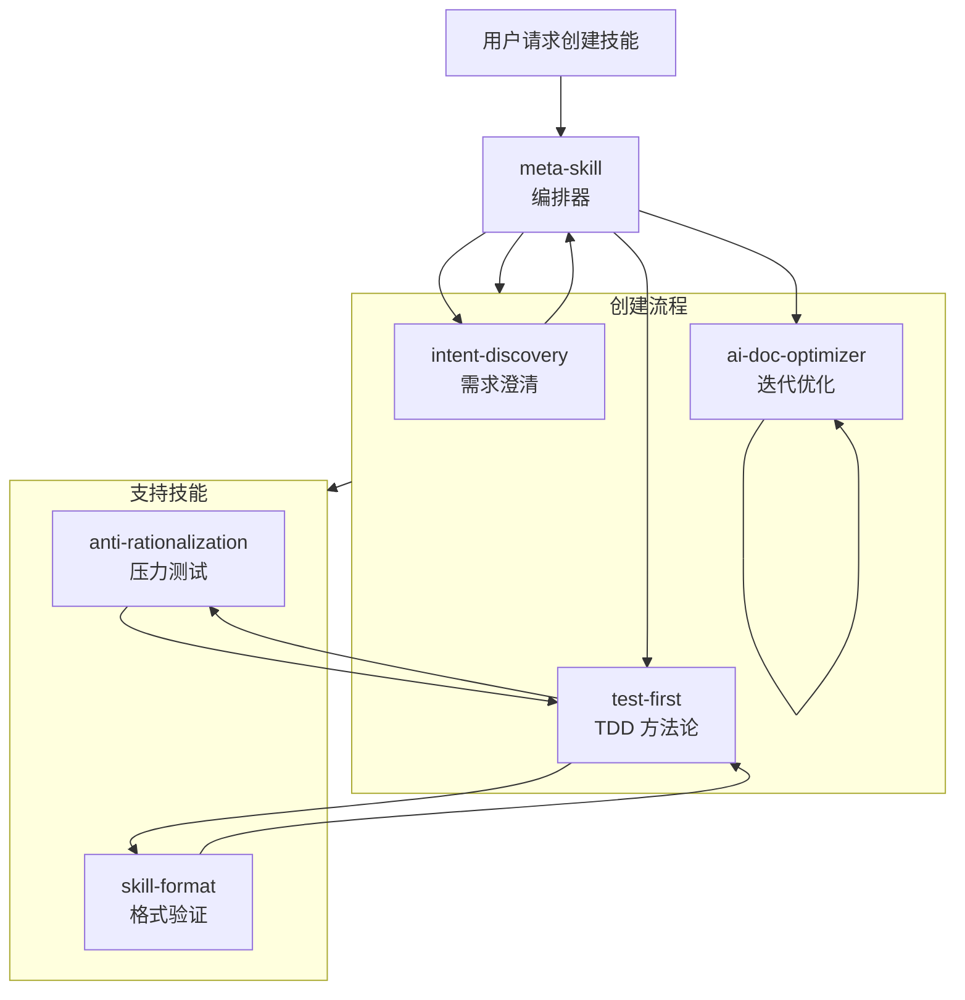

# Meta Skill

**创建完备且检索优化的自定义 AI 技能。** meta-skill 使用 **TDD + 反模式压力测试 + 双盲检测** 确保技能完备性，通过 **冗余移除 + 歧义澄清 + 渐进式披露** 最大化 AI 检索效率。

[English](README.md)

---

## 快速开始：创建你的第一个技能

```bash
# 在 Qwen Code 或 Claude Code 中，只需问：
"Create a skill for [你的需求]"
```

**示例：**
```
"Create a skill for automatic code review"
"Create a skill for writing unit tests"
"Create a skill for optimizing prompts"
```

meta-skill 将自动：

**确保完备性：**
1. **TDD** - 先写测试定义预期行为
2. **反模式压力测试** - 在压力场景下捕获并封堵漏洞
3. **双盲检测** - 验证候选方案显著优于基线

**优化 AI 检索：**
4. **歧义澄清** - 解析模糊语义
5. **冗余移除** - 消除重复内容
6. **渐进式披露** - 信息结构从简单到复杂

7. **打包** 为 `.skill` 文件即可使用

---

## 核心理念

**自演进：元技能使用自己的流程来创建和持续改进技能（包括它自己），直到收敛。**

`skills/` 目录包含 meta-skill 在创建流程中调用的内置技能库。

---

## 核心流程

```
意图发现 → TDD 驱动 (RED-GREEN-REFACTOR + Anti-Rationalization) → 双盲检测 → AI 检索优化 → 打包部署
```

| 阶段 | 技能 | 说明 |
|------|------|------|
| **意图发现** | `intent-discovery` | 渐进式提问澄清模糊需求，输出 `output_dir` 和技能类型 |
| **TDD 驱动** | `test-first` + `anti-rationalization` | **RED**: 设计压力场景 + 捕获说辞 → **GREEN**: 说服原则加固 + 漏洞封堵 → **REFACTOR**: 重测验证直到无新说辞 |
| **双盲检测** | `agents/{grader,comparator,analyzer}` | 盲评 candidate vs baseline，验证显著优于基线（选择率>70% AND 通过率提升>20%） |
| **AI 检索优化** | `ai-doc-optimizer` | 迭代优化直到收敛（连续 2 轮语义等价或 max_iterations=5） |
| **打包部署** | `scripts/package_skill.py` | 生成 `.skill` 文件，验证：行数<500、Mermaid 流程图、kebab-case 命名 |

**Anti-Rationalization 融入 TDD**:
| TDD 阶段 | Anti-Rationalization 策略 |
|---------|--------------------------|
| **RED** | 设计≥3 种压力叠加场景，对抗测试捕获说辞（逐字记录） |
| **GREEN** | 用说服原则加固（权威 + 承诺 + 社会证明），封堵漏洞（No exceptions + 逐一禁止） |
| **REFACTOR** | 重测验证，发现新说辞→继续加固，直到无新说辞 |

---

## 技能系统架构

```
┌─────────────────────────────────────────────────────────────┐
│  skills/  (内置技能库)                                       │
│                                                              │
│  ┌──────────────────────────────────────────────────────┐   │
│  │  meta-skill/ (编排器)                                 │   │
│  │  - SKILL.md                                          │   │
│  │  - agents/ (grader, analyzer, comparator)            │   │
│  │  - scripts/ (package_skill.py, aggregate_benchmark)  │   │
│  └──────────────────────────────────────────────────────┘   │
│                                                              │
│  ┌──────────────────────────────────────────────────────┐   │
│  │  子技能 (meta-skill 在流程中调用)                       │   │
│  │  - intent-discovery/  - test-first/                  │   │
│  │  - anti-rationalization/  - skill-format/            │   │
│  │  - ai-doc-optimizer/                                 │   │
│  └──────────────────────────────────────────────────────┘   │
└─────────────────────────────────────────────────────────────┘
```

**注意**: 创建**新技能**时，输出到用户指定的目录（`~/.qwen/skills/`、`./` 等），而不是 `meta-skill/skills/`。

---

## 技能关系图



---

## 技能列表

### 内置技能库

这些技能协作创建新技能：

| 技能 | 在技能创建中的角色 |
|------|-------------------|
| `meta-skill` | **编排器** — 协调整个技能创建流水线 |
| `intent-discovery` | **需求分析师** — 渐进式提问澄清模糊需求 |
| `test-first` | **TDD 引擎** — 先写测试确保正确性 |
| `anti-rationalization` | **质量保证** — 压力测试规则防止漏洞 |
| `skill-format` | **验证器** — 确保 SKILL.md 遵循正确格式 |
| `ai-doc-optimizer` | **优化器** — 迭代优化文档供 AI 高效读取 |

### 技能如何协作

当你让 meta-skill 创建新技能时：

```
用户请求 → intent-discovery (澄清) → test-first (写测试)
           → anti-rationalization (压力测试) → ai-doc-optimizer (优化)
           → skill-format (验证) → .skill 文件
```

每个子技能处理创建过程的特定方面，确保最终技能：
- **定义清晰**（需求明确）
- **测试覆盖**（TDD 驱动）
- **健壮可靠**（抗说辞压力测试）
- **文档完善**（AI 读取优化）
- **格式正确**（格式验证通过）

---

## 自演进

`skills/` 中的所有技能都通过 meta-skill 流程创建和维护：

```
v0.1: 单一体化技能（500+ 行，复杂）
    ↓ TDD + 拆分 (通过 meta-skill)
v0.2: 拆分为专注的子技能
    ↓ 重构 (通过 meta-skill)
v0.3: 移除冗余，澄清歧义
    ↓ 收敛 (通过 meta-skill)
v1.0: 最终优化版本
```

**核心洞察**：meta-skill 使用它编排的相同流程来进化自己和子技能。

---

## 目录结构

```
meta-skill/
├── skills/
│   ├── meta-skill/
│   │   ├── SKILL.md
│   │   ├── agents/              # grader.md, analyzer.md, comparator.md
│   │   └── scripts/             # package_skill.py, aggregate_benchmark.py
│   ├── intent-discovery/
│   │   └── SKILL.md
│   ├── test-first/
│   │   ├── SKILL.md
│   │   └── evals/
│   ├── anti-rationalization/
│   │   └── SKILL.md
│   ├── skill-format/
│   │   └── SKILL.md
│   └── ai-doc-optimizer/
│       └── SKILL.md
├── .qwen/
└── README.md
```

**注意**：`skills/` 包含 meta-skill 的内置技能库。通过 meta-skill 创建的新技能放在用户指定的目录中（如 `~/.qwen/skills/`、`./`），而不是 `meta-skill/skills/`。

---

## 扩展支持

本项目同时支持 **Claude Code Plugin** 和 **Qwen Code Extension**。

### 安装方式

**Claude Code：**
```bash
/plugin marketplace add https://github.com/Z-JaDe/meta-skill
/plugin install meta-skill
```

**Qwen Code：**
```bash
# 从远程 URL 安装
qwen extensions install https://github.com/Z-JaDe/meta-skill

# 或链接本地扩展（开发模式）
qwen extensions link /path/to/meta-skill
```

**Cursor：**

在 Cursor Agent 聊天中，从市场安装：

```text
/plugin-add meta-skill
```

### 配置文件

| 平台 | 配置文件 |
|------|---------|
| Claude Code | `.claude-plugin/marketplace.json` |
| Qwen Code | `qwen-extension.json` |
| Cursor | `.cursor-plugin/plugin.json` |

---

## 许可证

MIT

---

## 致谢

本项目受到以下项目启发：

- **Anthropic 的 `skill-creator`** - 技能创建方法论
- **Superpowers 的 `writing-skills`** - 技能编写模式
