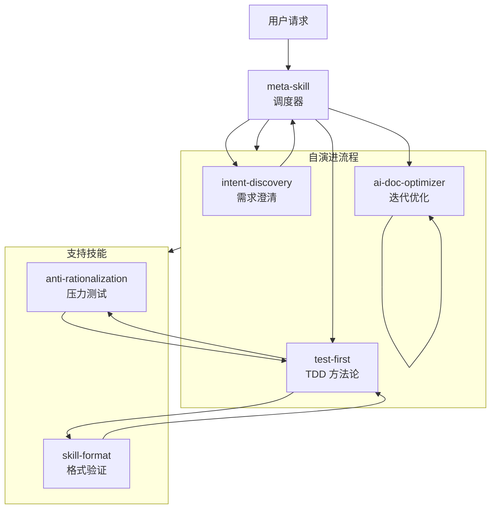

# Meta Skill

一个用于创建和管理技能的元技能系统。

---

## 核心理念

**自演进：创建一个混乱的最初版本，然后通过不断拆分、重构、优化直到收敛。**

元技能首先创建一个最初版本（可能比较乱、比较复杂），然后通过持续的迭代拆分和精炼，自己更新自己，最终优化到收敛状态。

---

## 核心流程

```
创建 v0.1 → 拆分 → 重构 → 收敛
```

| 阶段 | 说明 |
|------|------|
| **创建 v0.1** | 快速创建粗糙的初版（乱没关系） |
| **拆分** | 将复杂技能拆分为更小、更专注的技能 |
| **重构** | 精简结构、移除冗余、澄清歧义 |
| **收敛** | 迭代直到无法进行有意义的改进 |

---

## 技能列表

| 技能 | 描述 |
|------|------|
| `intent-discovery` | 通过渐进式提问澄清模糊需求 |
| `test-first` | TDD 方法论：先写测试再实现 |
| `anti-rationalization` | 压力测试规则并封堵合理化漏洞 |
| `skill-format` | 格式化和验证 SKILL.md 文件 |
| `ai-doc-optimizer` | 通过迭代收敛优化文档供 AI 高效读取 |
| `meta-skill` | 编排完整的技能创建/更新流程 |

---

## 技能关系图



---

## 自演进示例

```
v0.1: 单一体化技能（500+ 行，复杂）
    ↓ 拆分
v0.2: 拆分为 3 个专注技能
    ↓ 重构
v0.3: 移除冗余，澄清歧义
    ↓ 收敛
v1.0: 最终优化版本（3 轮迭代后收敛）
```

---

## 目录结构

```
meta-skill/
├── skills/
│   ├── intent-discovery/
│   ├── test-first/
│   ├── anti-rationalization/
│   ├── skill-format/
│   ├── ai-doc-optimizer/
│   └── meta-skill/              # 元技能本身
├── .qwen/                       # Qwen 配置
└── README.md
```

---

## 使用方式

当需要创建或修改技能时，`meta-skill` 会自动：

1. **创建 v0.1** - 快速粗糙初稿（乱没关系）
2. **提问澄清需求** - 精炼需求
3. **拆分与重构** - 迭代优化
4. **收敛** - 无法进行有意义改进时停止

---

## 许可证

MIT

---

## 致谢

本项目受到以下项目启发：

- **Anthropic 的 `skill-creator`** - 技能创建方法论
- **Superpowers 的 `writing-skills`** - 技能编写模式
