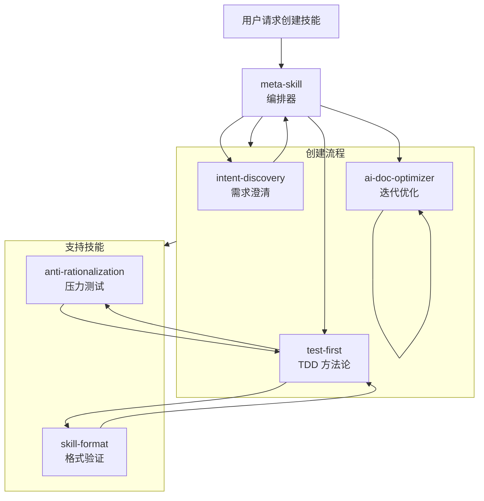

# Meta Skill

一个自演进的技能系统：meta-skill 编排流程（intent-discovery → TDD → 盲比较 → 优化）来迭代创建和演进技能。

---

## 核心理念

**自演进：元技能使用自己的流程来创建和持续改进技能（包括它自己），直到收敛。**

`skills/` 目录包含 meta-skill 在创建流程中调用的内置技能库。

---

## 核心流程

```
创建 v0.1 → TDD (RED-GREEN-REFACTOR) → 盲比较 → 优化 → 打包
```

| 阶段 | 说明 |
|------|------|
| **创建 v0.1** | 快速创建粗糙的初版（乱没关系） |
| **TDD** | RED: 写失败测试 → GREEN: 让测试通过 → REFACTOR: 泛化 |
| **盲比较** | 比较有技能 vs 基线以验证改进 |
| **优化** | 使用 ai-doc-optimizer 优化供 AI 高效读取 |
| **打包** | 生成 .skill 文件用于部署 |

---

## 技能系统架构

```
┌─────────────────────────────────────────────────────────────┐
│  skills/  (内置技能库)                                       │
│                                                              │
│  ┌──────────────────────────────────────────────────────┐   │
│  │  meta-skill/ (编排器)                                 │   │
│  │  - SKILL.md                                          │   │
│  │  - agents/ (grader, analyzer, comparator)            │   │
│  │  - scripts/ (package_skill.py, aggregate_benchmark)  │   │
│  └──────────────────────────────────────────────────────┘   │
│                                                              │
│  ┌──────────────────────────────────────────────────────┐   │
│  │  子技能 (meta-skill 在流程中调用)                       │   │
│  │  - intent-discovery/  - test-first/                  │   │
│  │  - anti-rationalization/  - skill-format/            │   │
│  │  - ai-doc-optimizer/                                 │   │
│  └──────────────────────────────────────────────────────┘   │
└─────────────────────────────────────────────────────────────┘
```

**注意**: 创建**新技能**时，输出到用户指定的目录（`~/.qwen/skills/`、`./` 等），而不是 `meta-skill/skills/`。

---

## 技能关系图



---

## 技能列表

| 技能 | 描述 |
|------|------|
| `meta-skill` | **编排器** — 协调技能创建/演进流程 |
| `intent-discovery` | 通过渐进式提问澄清模糊需求 |
| `test-first` | TDD 方法论：先写测试再实现 |
| `anti-rationalization` | 压力测试规则并封堵合理化漏洞 |
| `skill-format` | 格式化和验证 SKILL.md 文件 |
| `ai-doc-optimizer` | 通过迭代收敛优化文档供 AI 高效读取 |

---

## 自演进

`skills/` 中的所有技能都通过 meta-skill 流程创建和维护：

```
v0.1: 单一体化技能（500+ 行，复杂）
    ↓ TDD + 拆分 (通过 meta-skill)
v0.2: 拆分为专注的子技能
    ↓ 重构 (通过 meta-skill)
v0.3: 移除冗余，澄清歧义
    ↓ 收敛 (通过 meta-skill)
v1.0: 最终优化版本
```

**核心洞察**：meta-skill 使用它编排的相同流程来进化自己和子技能。

---

## 目录结构

```
meta-skill/
├── skills/
│   ├── meta-skill/
│   │   ├── SKILL.md
│   │   ├── agents/              # grader.md, analyzer.md, comparator.md
│   │   └── scripts/             # package_skill.py, aggregate_benchmark.py
│   ├── intent-discovery/
│   │   └── SKILL.md
│   ├── test-first/
│   │   ├── SKILL.md
│   │   └── evals/
│   ├── anti-rationalization/
│   │   └── SKILL.md
│   ├── skill-format/
│   │   └── SKILL.md
│   └── ai-doc-optimizer/
│       └── SKILL.md
├── .qwen/
└── README.md
```

**注意**：`skills/` 包含 meta-skill 的内置技能库。通过 meta-skill 创建的新技能放在用户指定的目录中（如 `~/.qwen/skills/`、`./`），而不是 `meta-skill/skills/`。

---

## 使用方式

**创建新技能：**

```bash
# 在 Qwen/Claude 中触发 meta-skill
"创建一个用于 [你的需求] 的技能"
```

meta-skill 将：
1. 通过 `intent-discovery` 澄清需求（包括 output_dir）
2. 通过 `test-first` 先写测试
3. 通过 `anti-rationalization` 压力测试（如果是纪律强制型）
4. 通过 `ai-doc-optimizer` 优化文档
5. 打包为 .skill 文件到用户指定的目录

---

## 许可证

MIT

---

## 致谢

本项目受到以下项目启发：

- **Anthropic 的 `skill-creator`** - 技能创建方法论
- **Superpowers 的 `writing-skills`** - 技能编写模式
