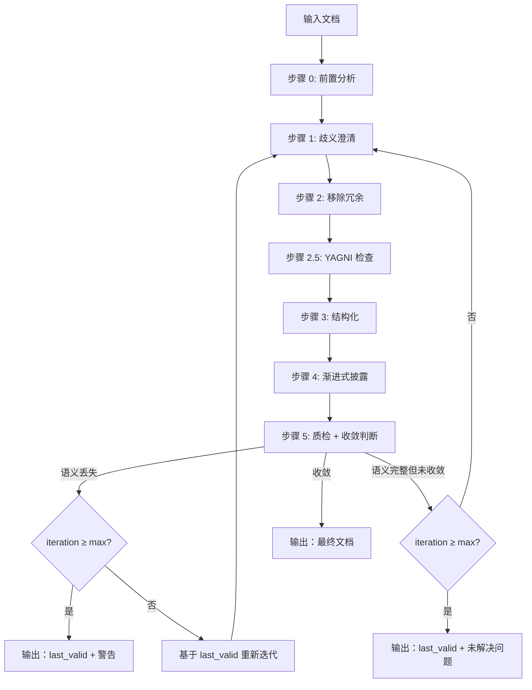

# AI Doc Optimizer

## Overview

**输入**: 冗长文档 → **输出**: AI 高效读取文档（收敛版本或 max_iterations 内最优版本）

**原则**:
| 原则 | 说明 |
|------|------|
| 压缩 | 是结果，非目标 |
| 语义 | 保留 100% |
| 歧义 | 澄清 100% |
| 锁定 | 定位/原则 修改需用户授权 |
| 独立 | 零依赖封闭语境 |
| 迭代 | 收敛或达上限停止 |

**不适用**: 创意写作、法律文档、营销文案

---

## Core Pattern



**执行分工**:
- 主 Agent: 调度和协调 SubAgent 流转，判断收敛
- SubAgent: 执行每轮迭代（步骤 0-5）

**SubAgent 启动机制**:
- 当前在主 Agent → 直接启动新 SubAgent 实例
- 当前在 SubAgent → 通知主 Agent 启动新 SubAgent 实例

**迭代状态**:
| 变量 | 含义 |
|------|------|
| iteration_count | 当前迭代次数，初始 0 |
| max_iterations | 最大迭代次数，默认 5 |
| last_valid | 上一轮语义完整的版本；仅在步骤 5 判定"语义完整但未收敛"时更新 |
| convergence_streak | 连续收敛计数，初始 0；满足收敛标准时 +1；未满足时置 0 |

---

## Implementation

### 步骤 0: 前置分析

**AI 理解偏差**: AI 易基于训练数据产生理解偏差；明确文档定位 → 锚定优化方向 → 避免错误优化

**输出模板**:
```
1. 文档定位：目标读者、使用场景、核心目的
2. 整体结构：章节数、平均长度、层级深度
3. 问题识别：歧义（KISS）、冗余（DRY）、结构（KISS）、过度设计（YAGNI）—类型详见步骤 1–2.5
4. 优化优先级：P0 / P1 / P2
```

**章节调整规则**:
| 问题 | 规则 |
|------|------|
| 层级>4 | 扁平化至≤4 级 |
| 节>500 字 | 拆分为多小节 |
| 顺序混乱 | 快速开始→认证→参考→故障排查 |

### 步骤 1: 歧义澄清

**零依赖封闭语境**: 文档内自解释，不依赖外部文件、链接或上下文；读者仅读本文即可理解所有术语与流程

**AI 幻觉风险**: AI 存在幻觉倾向，遇歧义时易自行填充假设；澄清歧义 → 流程确定 → 降低幻觉风险

**歧义类型**:
| 类型 | 处理 |
|------|------|
| 模糊词 | "快速响应" → `<100ms (p95)` |
| 指代不明 | "该功能" → 具体名词 |
| 隐含假设 | "测试通过后提交" → `所有单元测试通过 → 提交` |
| 术语未定义 | "TDD" → `TDD=测试驱动开发` |
| 语境依赖 | "正常情况" → 枚举场景 |

### 步骤 2: 移除冗余

**AI 处理效率**: 冗余增加 token 消耗与推理负担；精简表述 → 降低成本 → 提升响应速度

**冗余类型**:
| 类型 | 处理 | DRY 层次 |
|------|------|----------|
| 填充语 | "为了...→为..."、删 "需要注意的是" | 语句 |
| 被动语态 | 转主动："系统验证数据" | 语句 |
| 弱动词 | 强化："计算总额" | 语句 |
| 重复陈述 | 合并保留一次 | 语句 |
| 概念重复 | 保留一处，他处引用或删除 | 段落 |
| 信息分散 | 聚合到单一章节 | 段落 |
| 章节重复 | 多个章节说同一件事→合并 | 章节 |
| 表格重复 | 多个表格结构相同→合并 | 结构 |
| 流程重复 | 多个流程图有重复步骤→抽取子流程 | 结构 |

**边界**: 不可丢失"完整"等关键语义

### 步骤 2.5: YAGNI 检查

**AI 检索效率**: AI 检索文档时有注意力偏向；低频内容 → 大概率不被注意 → 增加 token 成本

**过度设计类型**:
| 类型 | 判断标准 | 处理 |
|------|----------|------|
| 未来内容 | 包含 "未来可能"、"后续计划"、"待实现" | 删除或移至附录 |
| 低频场景 | 文档定位中未提及，或明确标注 "罕见"、"特殊情况" | 精简或移至附录 |
| 过度详细示例 | 示例长度 > 原理说明长度的 2 倍 | 精简示例，保留核心部分 |
| 错误位置内容 | 内容与当前章节主题不匹配 | 移动至正确章节 |

**边界**: 保留核心场景的完整说明

### 步骤 3: 结构化

**AI 解析效率**: 结构化数据（表格/列表）比自然语言段落解析更快更准；结构化 → 降低解析错误 → 提升理解准确度

**转换规则**:
| 场景 | 规则 |
|------|------|
| 并列项目 | 3+ 项→列表；含多属性→表格 |
| 步骤序列 | 有时序/依赖→编号；无序→列表 |
| 对比/分类 | 表格 |
| 流程图 | Mermaid(优先)/DOT，**禁止 ASCII** |

### 步骤 4: 渐进式披露

**AI 上下文窗口**: AI 处理长文档时注意力衰减；渐进式披露 → 核心信息前置 → 提升关键信息提取率

| 文档大小 | 结构 |
|----------|------|
| <300 行 | 单层 |
| ≥300 行 | 概述→核心→详情→示例 |

**原则**: 高频前置，低频后置

### 步骤 5: 质检 + 收敛判断

**AI 自我验证**: AI 易过度自信跳过验证；强制质检 → 对比 last_valid → 防止语义丢失与过度优化

**收敛标准**（同时满足）:
| 检查项 | 标准 |
|--------|------|
| 语义等价 | 与 last_valid 100% 等价 |
| 结构稳定 | 章节/列表/表格无变化 |
| 表述一致 | 关键术语/定义无变化 |
| 无新增修复 | 本轮未新增歧义澄清或冗余移除 |

**判定逻辑**:
1. 语义不等价 → 达上限：输出 last_valid + 警告；否则：基于 last_valid 重新迭代
2. 满足收敛 → `convergence_streak+1`；≥2 → 收敛输出
3. 未满足 → `convergence_streak=0`，更新 `last_valid`
4. 达上限 → 输出 last_valid + 未解决问题列表

**质检项**（部署时逐项勾选）:
- 定位锁定：定位/原则 未更改
- 语义保留：逐句对比，无丢失
- 歧义澄清（KISS）：零依赖测试通过
- 冗余移除（DRY）：无语句/章节/表格/流程图重复
- 过度设计移除（YAGNI）：无未来内容/低频场景/过度详细示例
- 效率提升：同等信息量，行数减少或结构更清晰
- 结构已优化：列表/表格/流程图
- 渐进式披露正确
- 收敛：连续 2 轮或达上限

---

## Anti-Patterns

| 错误 | Red Flag | 修复 |
|------|----------|------|
| 主 Agent 自己执行优化 | "这个很快，我直接做" | 必须调度 SubAgent 执行步骤 0-5 |
| 过度压缩 | "字数减少就是好" | 保留 100% 语义 |
| 微改动 | "改了一点就算优化" | 忽略（歧义澄清除外） |
| 未锁定区域 | "定位/原则可以优化" | 锁定定位/原则 |
| ASCII 流程图 | "ASCII 更简单" | 使用 Mermaid/DOT |
| 未达收敛停止 | "差不多就行了" | 连续 2 轮收敛或达上限 |
| 未检查章节重复 | "语句不重复就行" | 检查章节/表格/流程图重复 |
| 保留低频内容 | "AI 可能用得上" | 删除或移至附录 |
| 过度详细示例 | "示例越多越好" | 精简示例，保留核心 |

**Red Flags**（停止并重新开始）:
| 情况 | 处理 |
|------|------|
| 主 Agent 未调度 SubAgent | 停止，调度 SubAgent 重新执行 |
| 语义丢失 | 基于 last_valid 重新迭代 |
| 定位/原则 被改 | 恢复并锁定 |

---

## Verification

```bash
wc -w skills/<skill-name>/SKILL.md  # 检查字数
cat .test/iteration-N/convergence.json | jq .  # 验证收敛
```
