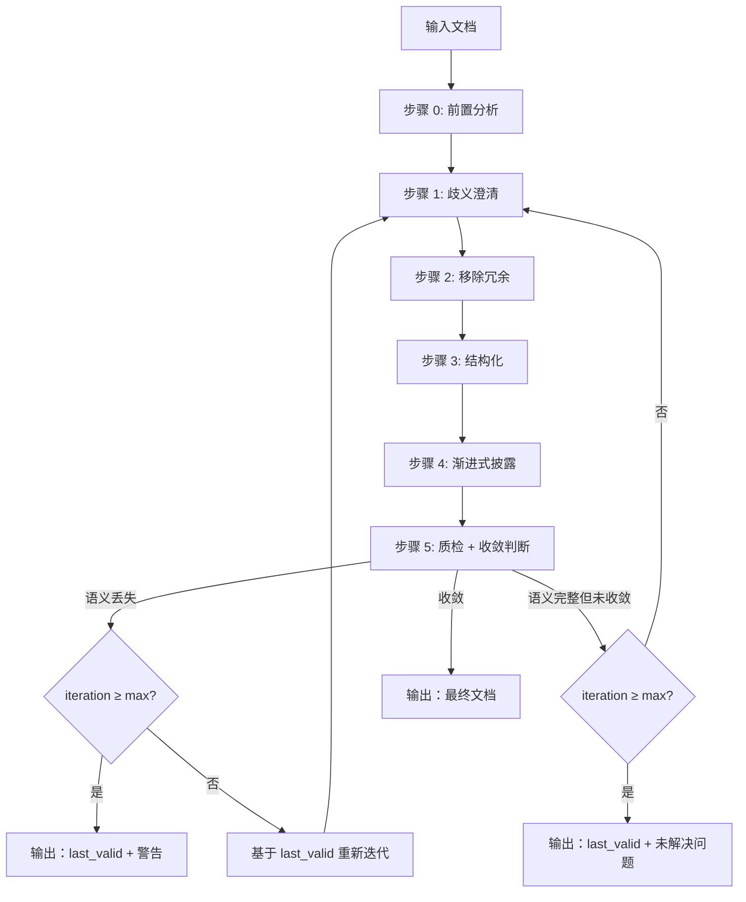

# AI Doc Optimizer

## Overview

**输入**: 冗长文档 → **输出**: AI 高效读取文档（收敛版本或 max_iterations 内最优版本）

**原则**:
| 原则 | 说明 |
|------|------|
| 压缩 | 是结果，非目标 |
| 语义 | 保留 100% |
| 歧义 | 澄清 100% |
| 锁定 | 定位/原则/ALWAYS 修改需用户授权 |
| 独立 | 零依赖封闭语境 |
| 迭代 | 收敛或达上限停止 |

**不适用**: 创意写作、法律文档、营销文案

---

## Core Pattern



**执行模式**: 主 Agent 将每轮迭代（步骤 0-5）委派给子 Agent 执行

**迭代状态**:
- `iteration_count`: 当前迭代次数，初始 0
- `max_iterations`: 最大迭代次数，默认 5
- `last_valid`: 上一个语义完整的有效版本
- `convergence_streak`: 连续收敛计数，初始 0

---

## Implementation

### 步骤 0: 前置分析

**输出模板**:
```
1. 文档定位
   - 目标读者：
   - 使用场景：
   - 核心目的：

2. 整体结构
   - 章节数：
   - 平均长度：
   - 层级深度：

3. 问题识别
   - 歧义：
   - 冗余：
   - 结构问题：

4. 优化优先级
   - P0:
   - P1:
   - P2:
```

**章节调整规则**:
| 问题 | 规则 |
|------|------|
| 层级>4 | 扁平化至≤4 级 |
| 节>500 字 | 拆分为多小节 |
| 顺序混乱 | 快速开始→认证→参考→故障排查 |

### 步骤 1: 歧义澄清

**零依赖封闭语境**: 文档内自解释，不依赖外部上下文

**歧义类型**:
| 类型 | 处理 |
|------|------|
| 模糊词 | "快速响应" → `<100ms (p95)` |
| 指代不明 | "该功能" → 具体名词 |
| 隐含假设 | "测试通过后提交" → `所有单元测试通过 → 提交` |
| 术语未定义 | "TDD" → `TDD=测试驱动开发` |
| 语境依赖 | "正常情况" → 枚举场景 |

### 步骤 2: 移除冗余

**冗余类型**:
| 类型 | 处理 |
|------|------|
| 填充语 | "为了...→为..."、"需要注意的是→删除" |
| 被动语态 | 转主动："系统验证数据" |
| 弱动词 | 强化："计算总额" |
| 重复陈述 | 合并保留一次 |
| 概念重复 | 保留一处，他处引用或删除 |
| 信息分散 | 聚合到单一章节 |

**边界**: 不可丢失"完整"等关键语义

### 步骤 3: 结构化

**转换规则**:
| 场景 | 规则 |
|------|------|
| 并列项目 | 3+ 项→列表；含多属性→表格 |
| 步骤序列 | 有时序/依赖→编号；无序→列表 |
| 对比/分类 | 表格 |
| 流程图 | Mermaid(优先)/DOT，**禁止 ASCII** |

### 步骤 4: 渐进式披露

**决策表**:
| 文档大小 | 结构 |
|----------|------|
| <300 行 | 单层 |
| ≥300 行 | 概述→核心→详情→示例 |

**原则**: 高频前置，低频后置

### 步骤 5: 质检 + 收敛判断

**收敛标准**:
| 检查项 | 标准 |
|--------|------|
| 语义等价 | 与 last_valid 100% 等价 |
| 结构稳定 | 章节/列表/表格无变化 |
| 表述一致 | 关键术语/定义无变化 |
| 无新增修复 | 本轮未新增歧义澄清或冗余移除 |

**判定逻辑**:
1. 语义不等价 → 达上限输出 last_valid + 警告；否则重新迭代
2. 满足收敛 → `convergence_streak+1`；≥2→收敛输出
3. 未满足 → `convergence_streak=0`，更新 `last_valid`
4. 达上限 → 输出 last_valid + 未解决问题列表

**质检项**:
- 定位锁定：定位/原则/ALWAYS 未更改
- 语义保留：逐句对比，无丢失
- 歧义澄清：零依赖测试通过
- 效率提升：同等信息量，行数减少或结构更清晰

---

## Anti-Patterns

| 错误 | 修复 |
|------|------|
| 过度压缩 | 保留 100% 语义 |
| 微改动 | 忽略（歧义澄清除外） |
| 未锁定区域 | 锁定定位/原则/ALWAYS |
| ASCII 流程图 | 使用 Mermaid/DOT |
| 未达收敛停止 | 连续 2 轮收敛或达上限 |

**Red Flags**（停止并重新开始）:
| 情况 | 处理 |
|------|------|
| 语义丢失 | 基于 last_valid 重新迭代 |
| 定位/原则/ALWAYS 被改 | 恢复并锁定 |

---

## Verification

```bash
wc -w skills/path/SKILL.md  # 检查字数
cat iteration-N/convergence.json | jq .  # 验证收敛
```

**部署检查清单**:
- [ ] 语义保留 100%
- [ ] 歧义已澄清（零依赖测试通过）
- [ ] 结构已优化（列表/表格/流程图）
- [ ] 渐进式披露正确
- [ ] 收敛（连续 2 轮或达上限）
- [ ] 定位/原则/ALWAYS 已锁定
