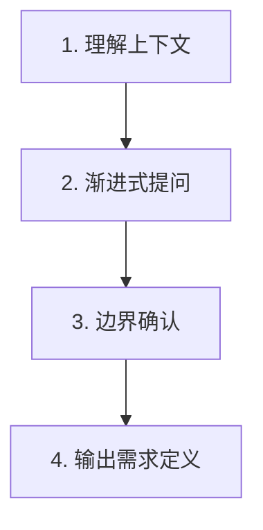

# Intent Discovery

## Overview

**铁律**: `NO EXECUTION WITHOUT CLARIFICATION`

从模糊想法 → 清晰可执行需求。先澄清再执行。

| 适用 | 不适用 |
|------|--------|
| 技能创建、功能开发、Bug 修复、代码重构、文档编写 | 需求已清晰明确的任务 |

---

## Core Pattern



**渐进式提问**：一次一问、由粗到细、逐步缩小范围。

---

## Implementation

### 阶段 1: 理解上下文

**动态检索**（按 `requirement_type`）:
| 类型 | 检索内容 |
|------|----------|
| skill-creation | 现有技能目录、模板、命名规范 |
| feature-development | 项目结构、技术栈、现有类似模块 |
| bug-fix | 错误日志、相关文件、修改历史 |
| refactoring | 目标模块、依赖图、测试覆盖 |
| documentation | 设计稿、API 文档、参考材料 |

**识别关键词**:
| 类型 | 示例 |
|------|------|
| 动作词 | 创建/修改/优化/修复/添加 |
| 对象词 | 功能/技能/文档/测试/组件 |
| 质量词 | 快速/健壮/美观/简洁 |

### 阶段 2: 渐进式提问

**核心原理**: 人类一次只能处理有限信息（7±2，Miller 定律：短期记忆约 7 个组块）；由粗到细符合思维习惯；选择题降低决策成本。

**提问前准备**（所有场景必须执行）:
1. 读取参考文档：按 `requirement_type` 映射到同 workspace 内技能名（如 skill-creation→skill-format、documentation→ai-doc-optimizer；feature-development/bug-fix/refactoring→按当前项目类型选择对应文档）
2. 5W2H 分析（What/Why/Who/When/Where/How/How much 七问）:
   - What: 要做什么？（具体内容）
   - Why: 为什么做？（原因/目标）
   - Who: 谁负责？（主 Agent 协调分析，SubAgent 执行；本技能由两者共用）
   - When: 什么时候做？（在哪个阶段）
   - Where: 在哪做？（具体位置）
   - How: 怎么做？（具体方法）
   - How much: 做多少？（范围）
3. 澄清不合理处:
   - 用户要求不合理 → 沟通澄清
   - 范围过大 → 提醒边界
   - 可能风险 → 警告

**文档/内容优化场景**（`requirement_type` 为 documentation 或涉及文档优化时）：读取现有内容，识别问题（歧义/冗余/结构混乱等）。

**渐进式流程**（四层递进）:

| 层次 | 目的 | 问法示例 | 为什么这样问 |
|------|------|----------|-------------|
| 1. What（目标层） | 明确大方向 | "具体来说，让谁能够做什么？" | 先确定做什么，再谈怎么做 |
| 2. When（边界层） | 缩小范围 | "什么情况下应该使用？" | 明确适用场景，避免范围蔓延 |
| 3. Output（标准层） | 明确要求 | "完成后应该看到什么结果？" | 可衡量的标准，避免模糊 |
| 4. Test（验证层） | 确保可验证 | "如何判断它工作正常？" | 可验证的标准，避免主观 |

**提问技巧**:

| 技巧 | 正确 | 错误 | 原因 |
|------|------|------|------|
| 一次一问 | "主要给谁使用？" | "给谁用，在什么场景下用？" | 避免认知负载 |
| 选择题优先 | "输出格式：A) 代码 B) 文档 C) 配置？" | "你想要什么类型的输出？" | 降低决策成本 |
| 追问细节 | "A) 增删改查 B) 权限管理 C) 两者？" | 直接假设范围 | 避免假设错误 |
| 给出示例 | "例如：用户登录、权限管理？" | 不给示例 | 帮助理解 |

**分支处理**:

| 情况 | 处理 |
|------|------|
| 用户回答不清楚 | 提供选项 → 给出示例 → 追问细节 |
| 需求频繁变化 | 先确定当前版本 → 变更作为新迭代 |
| 范围不断扩大 | "这些是否都属于当前范围？" → 提醒边界 |

### 阶段 3: 边界确认

| 确认项 | 示例问法 |
|--------|----------|
| 不做的事情 | "有哪些事情明确不处理？" |
| 依赖关系 | "依赖其他系统/模块吗？" |
| 约束条件 | "技术约束？（语言/框架/版本）" |

按阶段 4 的 context 表中 `requirement_type` 对应行的示例字段逐项追问。

### 阶段 4: 输出需求定义

**统一输出格式**:

```json
{
  "requirement_type": "skill-creation | skill-improvement | feature-development | bug-fix | refactoring | documentation",
  "requirements": {
    "what": "要做什么",
    "when": "触发场景",
    "output": "预期输出",
    "test": "验证标准"
  },
  "boundaries": {
    "in_scope": [],
    "out_of_scope": []
  },
  "dependencies": [],
  "constraints": [],
  "context": {},
  "next_steps": []
}
```

**`context` 字段**（按 `requirement_type` 从下表选择填充）:
| 类型 | 示例字段 |
|------|----------|
| skill-creation | `skill_name`, `description`, `language`, `output_dir` |
| skill-improvement | `existing_skill_path`, `description`, `improvement_goal`, `preserve_behavior` |
| feature-development | `tech_stack`, `target_module` |
| bug-fix | `affected_files`, `repro_steps` |
| refactoring | `scope`, `preserve_behavior` |
| documentation | `audience`, `format` |

---

## Anti-Patterns

| 错误 | 修复 |
|------|------|
| 违反一次一问、选择题优先、停止假设 | 见阶段 2：提问技巧 |
| 需求频繁变化、范围扩大时不确认 | 见阶段 2：分支处理 |
| 在关键字段缺失时继续执行 | 缺失 `what/when/output/test` 任一字段即停止并追问 |

**Red Flags**（停止并重新开始）:
| 情况 | 处理 |
|------|------|
| 用户回答了但不理解 | "能再具体说明一下吗？" |
| 需求频繁变化、范围不断扩大 | 见阶段 2：分支处理 |

---

## Verification

```bash
wc -w skills/intent-discovery/SKILL.md
cat requirements.json | jq .  # requirements.json = 阶段 4 产出的需求定义
```

**部署检查清单**:
- [ ] 需求定义包含 What/When/Output/Test
- [ ] `requirements.what/when/output/test` 均为非空
- [ ] `requirement_type` 已判断
- [ ] 边界清晰（in_scope + out_of_scope）
- [ ] 依赖和约束已识别
- [ ] `context` 已按类型填充
