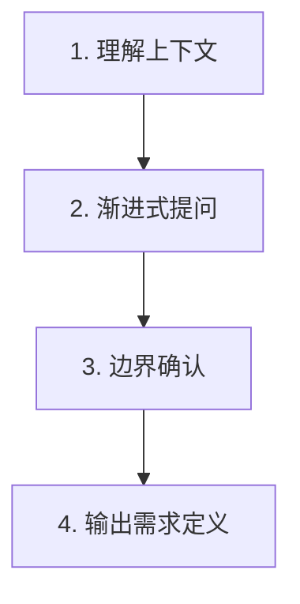

# Intent Discovery

## Overview

从模糊想法 → 清晰可执行的需求定义。**先澄清再执行**。

**铁律**: `NO EXECUTION WITHOUT CLARIFICATION`

**适用**: 用户提出模糊想法/功能请求

**不适用**: 需求已清晰明确的任务

---

## Core Pattern



---

## Implementation

### 阶段 1: 理解上下文

**动态检索上下文**:
| 用户请求类型 | 检索内容 |
|--------------|----------|
| 功能/组件 | 项目结构、技术栈、现有类似模块 |
| 技能创建 | 现有技能目录、模板、命名规范 |
| 文档编写 | 设计稿、API 文档、参考材料 |
| 问题修复 | 错误日志、相关文件、修改历史 |

**识别关键词**:
| 类型 | 示例 |
|------|------|
| 动作词 | 创建/修改/优化/修复/添加 |
| 对象词 | 功能/技能/文档/测试/组件 |
| 质量词 | 快速/健壮/美观/简洁 |

### 阶段 2: 渐进式提问

**核心四问**:
| 维度 | 示例问法 |
|------|----------|
| What | "具体来说，这个功能让谁能够做什么？" |
| When | "什么情况下应该使用这个功能？" |
| Output | "完成后应该看到什么结果？" |
| Test | "如何判断它工作正常？" |

**提问原则**:
| 原则 | 正确示例 | 错误示例 |
|------|----------|----------|
| 一次一问 | "这个功能主要给谁使用？" | "这个功能给谁用，在什么场景下用？" |
| 选择题优先 | "输出格式：A) 代码 B) 文档 C) 配置？" | "你想要什么类型的输出？" |
| 追问细节 | 用户："要用户管理"→追问："A) 增删改查 B) 权限管理 C) 两者？" | 直接假设功能范围 |

### 阶段 3: 边界确认

| 确认项 | 示例问法 |
|--------|----------|
| 不做的事情 | "有哪些事情是这个功能明确不处理的？" |
| 依赖关系 | "这个功能依赖其他系统/模块吗？" |
| 约束条件 | "有什么技术约束吗（语言/框架/版本）？" |
| 技能语言 | "技能文档用中文还是英文？" |
| 输出目录 | "技能放在哪里？A) 个人目录 (~/.qwen/) B) 项目目录 (./) C) 其他" |

### 阶段 4: 输出需求定义

```json
{
  "skill_name": "kebab-case-name",
  "description": "Use when [触发条件]",
  "language": "zh-CN | en-US",
  "output_dir": "~/.qwen/skills/xxx 或 ./skills/xxx",
  "requirements": {
    "what": "要做什么",
    "when": "触发场景",
    "output": "预期输出",
    "test": "验证标准"
  },
  "boundaries": {
    "in_scope": ["包含的功能"],
    "out_of_scope": ["不包含的功能"]
  },
  "dependencies": ["依赖的模块/技能"],
  "constraints": ["技术/资源约束"],
  "next_steps": ["建议的后续行动"]
}
```

---

## Anti-Patterns

| 错误 | 修复 |
|------|------|
| 一次性问多个问题 | 一次一问 |
| 问开放性问题 | 选择题优先 |
| 假设代替确认 | 停止假设，直接提问 |
| 需求频繁变化时不确认 | 先确定当前版本 |

**Red Flags**（停止并重新开始）:
| 情况 | 处理 |
|------|------|
| 用户回答了但不理解 | "能再具体说明一下吗？" |
| 需求频繁变化 | 先确定当前版本 |
| 范围不断扩大 | "这些功能是否都属于当前范围？" |

---

## Verification

```bash
wc -w skills/intent-discovery/SKILL.md  # 检查字数
cat requirements.json | jq .  # 验证输出
```

**部署检查清单**:
- [ ] 需求定义包含 What/When/Output/Test
- [ ] 边界清晰（in_scope + out_of_scope）
- [ ] 技能类型已判断
- [ ] 依赖和约束已识别
- [ ] 技能语言已确认
- [ ] 输出目录已确认（个人/项目 + 配置类型）
