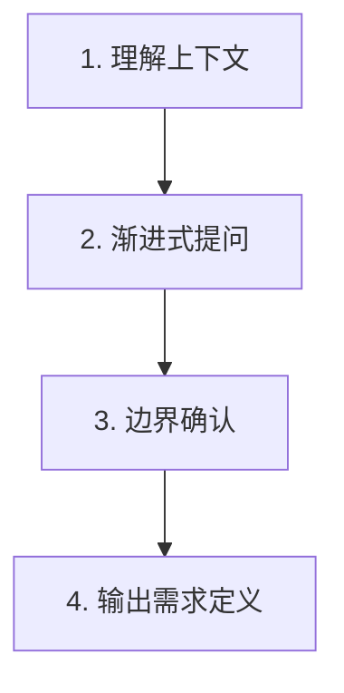

# Intent Discovery

## Overview

**铁律**: `NO EXECUTION WITHOUT CLARIFICATION`

从模糊想法 → 清晰可执行需求。先澄清再执行。

| 适用 | 不适用 |
|------|--------|
| 技能创建、功能开发、Bug 修复、代码重构、文档编写 | 需求已清晰明确的任务 |

---

## Core Pattern



**渐进式提问**：一次一问、由粗到细、逐步缩小范围。

---

## Implementation

### 阶段 1: 理解上下文

**动态检索**（按 `requirement_type`）:
| 类型 | 检索内容 |
|------|----------|
| skill-creation | 现有技能目录、模板、命名规范 |
| feature-development | 项目结构、技术栈、现有类似模块 |
| bug-fix | 错误日志、相关文件、修改历史 |
| refactoring | 目标模块、依赖图、测试覆盖 |
| documentation | 设计稿、API 文档、参考材料 |

**识别关键词**:
| 类型 | 示例 |
|------|------|
| 动作词 | 创建/修改/优化/修复/添加 |
| 对象词 | 功能/技能/文档/测试/组件 |
| 质量词 | 快速/健壮/美观/简洁 |

### 阶段 2: 渐进式提问

**核心四问**:
| 维度 | 示例问法 |
|------|----------|
| What | "具体来说，让谁能够做什么？" |
| When | "什么情况下应该使用？" |
| Output | "完成后应该看到什么结果？" |
| Test | "如何判断它工作正常？" |

**提问原则**:
| 原则 | 正确 | 错误 |
|------|------|------|
| 一次一问 | "主要给谁使用？" | "给谁用，在什么场景下用？" |
| 选择题优先 | "输出格式：A) 代码 B) 文档 C) 配置？" | "你想要什么类型的输出？" |
| 追问细节 | "A) 增删改查 B) 权限管理 C) 两者？" | 直接假设范围 |

### 阶段 3: 边界确认

| 确认项 | 示例问法 |
|--------|----------|
| 不做的事情 | "有哪些事情明确不处理？" |
| 依赖关系 | "依赖其他系统/模块吗？" |
| 约束条件 | "技术约束？（语言/框架/版本）" |

按 `requirement_type` 与 `context` 示例字段，追加类型特定追问。

### 阶段 4: 输出需求定义

**统一输出格式**:

```json
{
  "requirement_type": "skill-creation | feature-development | bug-fix | refactoring | documentation",
  "requirements": {
    "what": "要做什么",
    "when": "触发场景",
    "output": "预期输出",
    "test": "验证标准"
  },
  "boundaries": {
    "in_scope": [],
    "out_of_scope": []
  },
  "dependencies": [],
  "constraints": [],
  "context": {},
  "next_steps": []
}
```

**`context` 字段**（按 `requirement_type` 从下表选择填充）:
| 类型 | 示例字段 |
|------|----------|
| skill-creation | `skill_name`, `language`, `output_dir` |
| feature-development | `tech_stack`, `target_module` |
| bug-fix | `affected_files`, `repro_steps` |
| refactoring | `scope`, `preserve_behavior` |
| documentation | `audience`, `format` |

---

## Anti-Patterns

| 错误 | 修复 |
|------|------|
| 一次性问多个问题 | 一次一问 |
| 问开放性问题 | 选择题优先 |
| 假设代替确认 | 停止假设，直接提问 |
| 需求频繁变化时不确认 | 先确定当前版本 |

**Red Flags**（停止并重新开始）:
| 情况 | 处理 |
|------|------|
| 用户回答了但不理解 | "能再具体说明一下吗？" |
| 需求频繁变化 | 先确定当前版本 |
| 范围不断扩大 | "这些是否都属于当前范围？" |

---

## Verification

```bash
wc -w skills/intent-discovery/SKILL.md
cat requirements.json | jq .
```

**部署检查清单**:
- [ ] 需求定义包含 What/When/Output/Test
- [ ] `requirement_type` 已判断
- [ ] 边界清晰（in_scope + out_of_scope）
- [ ] 依赖和约束已识别
- [ ] `context` 已按类型填充
