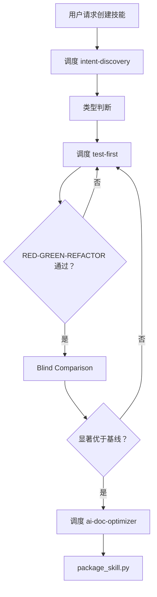

# Meta Skill

## Overview

编排技能创建/更新流程。**纯调度，不执行**。

**输入**: 模糊想法（创建）/ 现有技能 + 改进需求（更新）

**输出**: 打包好的 .skill 文件

**铁律**: `NO SKILL WITHOUT A FAILING TEST FIRST`（没有例外）

---

## Core Pattern



---

## Implementation

### 阶段 1: 意图捕捉

**调度**: `intent-discovery` — 渐进式提问澄清需求

**确认事项**:
- 技能名称和描述
- 技能语言（与用户输入保持一致）
- 输出目录：根据用户当前环境给出选项
  - 个人目录：`~/.qwen/` / `~/.claude/` / `~/.cursor/`
  - 项目目录：`./`
- 需求定义（what/when/output/test）
- 边界（in_scope/out_of_scope）
- 技能类型

**输出**:
```json
{
  "skill_name": "kebab-case-name",
  "description": "Use when [触发条件]",
  "language": "zh-CN | en-US",
  "output_dir": "~/.qwen/skills/xxx 或 ./skills/xxx",
  "requirements": {"what": "...", "when": "...", "output": "...", "test": "..."},
  "boundaries": {"in_scope": [], "out_of_scope": []},
  "skill_type": "纪律强制型 | 技术技能型 | 模式型 | 参考型"
}
```

### 阶段 2: 技能类型判断

| 类型 | 特征 | 测试方法 |
|------|------|----------|
| 纪律强制型 | 强制规则、有合规成本、可被合理化跳过 | 完整压力测试 |
| 技术技能型 | how-to 指南、工具使用 | 简化测试 + 应用场景验证 |
| 模式型 | 心智模型、决策框架 | 识别场景 + 反例测试 |
| 参考型 | API/语法/工具文档 | 检索测试 + 应用测试 |

### 阶段 3: TDD 循环（RED-GREEN-REFACTOR）

**调度**: `test-first` — 测试驱动开发

**输出**: evals.json + SKILL.md 初稿

| 阶段 | 操作 | 说明 |
|------|------|------|
| RED | 创建 evals.json → 运行子代理**不带技能** → 记录违反行为 | TDD: Watch it fail |
| GREEN | 调度 `skill-format` 编写 SKILL.md → 运行子代理**带技能** → 确认遵守规则 | TDD: Watch it pass |
| REFACTOR | 发现新漏洞 → 修订技能 → 泛化 + 精简 | 不过拟合测试用例 |

**纪律强制型额外操作**:
- RED: 调度 `anti-rationalization` 设计压力场景
- GREEN: 调度 `anti-rationalization` 加固规则

**迭代**: RED → GREEN → REFACTOR → 通过则进入 Blind Comparison

### 阶段 4: Blind Comparison

**执行**: 内部 — 使用 `agents/comparator.md` 盲比较

**流程**:
1. 并行运行：With-skill vs 基线（Without/Old）
2. `agents/grader.md` 评估断言
3. `python -m scripts.aggregate_benchmark <workspace>/iteration-N --skill-name <name>`
4. `agents/analyzer.md` 识别模式
5. `agents/comparator.md` 盲比较
6. 判断是否显著优于基线

**通过标准**: 比较器选择 With-skill + 关键断言通过率更高 + 输出质量更优

**失败处理**: 返回 REFACTOR → 重新验证

### 阶段 5: 文档优化

**调度**: `ai-doc-optimizer` — 优化 SKILL.md 供 AI 高效读取

### 阶段 6: 打包部署

```bash
python -m scripts.package_skill <path/to/skill-folder>
```

**输出**: `.skill` 文件

---

## Dependencies

| 名称 | 用途 | 阶段 |
|------|------|------|
| `intent-discovery` | 意图捕捉 | 1 |
| `test-first` | TDD 方法论 | 3 |
| `anti-rationalization` | 压力测试 + 规则加固 | 3 |
| `skill-format` | SKILL.md 格式规范 | 3 |
| `ai-doc-optimizer` | 文档优化 | 5 |
| `agents/grader.md` | 评估断言 | 4 |
| `agents/analyzer.md` | 分析基准模式 | 4 |
| `agents/comparator.md` | 盲比较 | 4 |
| `scripts/aggregate_benchmark.py` | 基准聚合 | 4 |
| `scripts/package_skill.py` | 技能打包 | 6 |

---

## Verification

```bash
wc -w skills/meta-skill/SKILL.md  # 字数
ls skills/meta-skill/agents/  # agents
ls skills/meta-skill/scripts/  # scripts
```

**部署检查清单**:
- [ ] 意图已澄清（含语言和输出目录）
- [ ] 技能类型已判断
- [ ] TDD 循环通过
- [ ] Blind Comparison 通过
- [ ] 文档已优化
- [ ] 技能已打包
