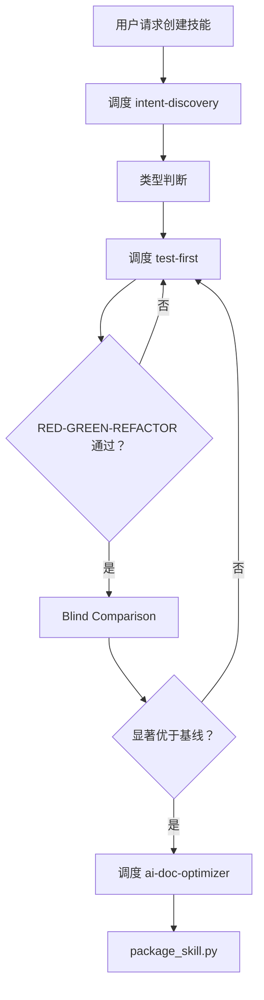
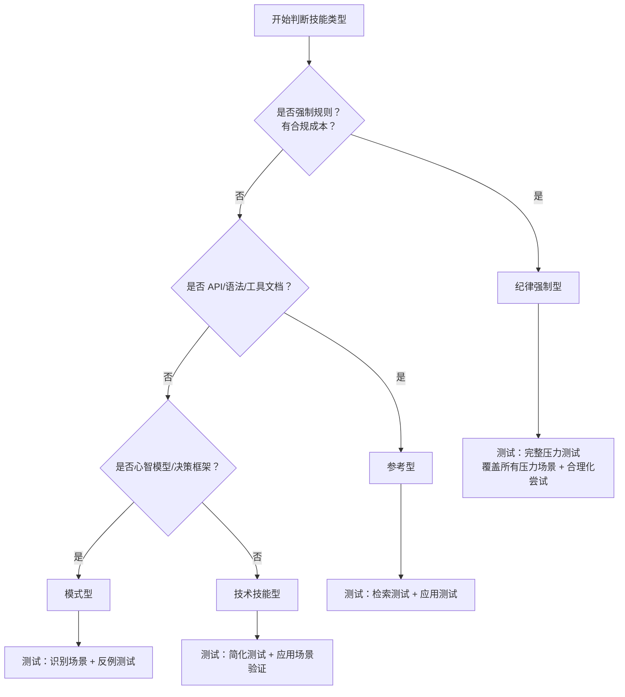
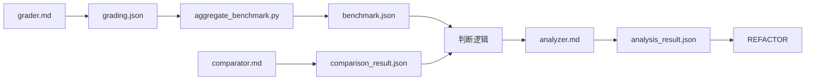

# Meta Skill

## Overview

编排技能创建/更新流程。**纯调度，不执行**。

**输入**: 模糊想法（创建）/ 现有技能 + 改进需求（更新）

**输出**: 打包好的 .skill 文件

**铁律**: `NO SKILL WITHOUT A FAILING TEST FIRST`（没有例外）

**执行上下文**:
- **子代理调度**: 描述任务目标，由 AI 选择合适工具执行（如 Qwen `qwen eval`、Claude Code 子进程、Cursor IDE 集成等）
- **技能调度**: 让当前 Agent 加载技能文件并遵循规则（如 `skill-format`、`agents/grader.md` 等）
- **最大迭代次数**: TDD 循环最多 5 次，Blind Comparison 最多 3 轮

---

## Terminology

| 术语 | 定义 |
|------|------|
| TDD | 测试驱动开发 (Test-Driven Development) |
| RED | 编写测试→运行失败 |
| GREEN | 编写实现→运行通过 |
| REFACTOR | 重构优化→保持通过 |
| Blind Comparison | 盲比较：评估者不知哪个是带技能输出的对比测试 |
| 渐进式提问 | 逐层深入提问，每轮基于上一轮答案 |
| 完整压力测试 | 覆盖所有压力场景 + 合理化尝试 |
| 简化测试 | 核心功能验证 + 典型场景 |
| 边界外场景 | 超出 in_scope 定义的场景 |
| 泛化 | 规则适用于边界外场景 |
| 反例测试 | 验证非目标场景不触发技能 |
| 检索测试 | 验证 AI 能正确检索到该技能 |
| 应用测试 | 验证技能能正确应用于目标场景 |
| 显著优于基线 | 比较器选择率>70% AND 断言通过率提升>20% |
| 合规成本 | 违反规则导致的负面后果（时间/质量/风险） |
| 识别场景 | 判断当前情境是否匹配技能触发条件 |
| 比较器选择率 | (comparison_result.json 中 winner_is_with_skill=true 的次数) / (总比较次数) |
| 断言通过率提升 | (with_skill.pass_rate - without_skill.pass_rate) / without_skill.pass_rate |

---

## Core Pattern



---

## Implementation

### 阶段 1: 意图捕捉

**调度**: `intent-discovery` 渐进式提问澄清需求

**确认事项**:
- 技能名称和描述
- 技能语言（与用户输入保持一致）
- 输出目录：按用户环境提供选项
  - 个人目录：`~/.qwen/` / `~/.claude/` / `~/.cursor/`
  - 项目目录：`./`
- 需求定义（what/when/output/test）
- 边界（in_scope/out_of_scope）
- 技能类型

**输出**:
```json
{
  "skill_name": "kebab-case-name",
  "description": "Use when [触发条件]",
  "language": "zh-CN | en-US",
  "output_dir": "~/.qwen/skills/xxx 或 ./skills/xxx",
  "requirements": {"what": "...", "when": "...", "output": "...", "test": "..."},
  "boundaries": {"in_scope": [], "out_of_scope": []},
  "skill_type": "纪律强制型 | 技术技能型 | 模式型 | 参考型"
}
```

### 阶段 2: 技能类型判断

**输出**: 判断技能类型，输出到 intent-discovery 的 JSON

**决策流程**:


**类型特征**:
| 类型 | 特征 | 测试方法 |
|------|------|----------|
| 纪律强制型 | 强制规则、有合规成本、用户可合理化跳过 | 完整压力测试：覆盖所有压力场景 + 合理化尝试 |
| 技术技能型 | how-to 指南、工具使用 | 简化测试 + 应用场景验证 |
| 模式型 | 心智模型、决策框架 | 识别场景 + 反例测试 |
| 参考型 | API/语法/工具文档 | 检索测试 + 应用测试 |

**纪律强制型额外操作**:
- 在阶段 3 开始前，**调度技能** `anti-rationalization` 设计压力场景
- 将压力场景追加到 evals.json（字段：`pressure_scenarios` 数组）

### 阶段 3: TDD 循环（RED-GREEN-REFACTOR）

**调度**: `test-first` 测试驱动开发

**最大迭代次数**: 5 次（超过则进入人工审查）

| 阶段 | 操作 | 说明 |
|------|------|------|
| RED | 创建 evals.json→**调度子代理执行**（不加载技能）→记录违反行为 | 见证失败<br>任务：执行 eval prompt，不加载技能<br>纪律强制型：使用含压力场景的 evals.json |
| GREEN | **调度技能** `skill-format` 编写 SKILL.md→**调度子代理执行**（加载技能）→确认遵守规则 | 见证通过<br>任务：执行 eval prompt，加载技能<br>纪律强制型：验证压力场景下仍遵守规则 |
| REFACTOR | 发现新漏洞→修订技能→泛化 + 精简 | 泛化：规则适用于边界外场景<br>新漏洞：grader 发现新的 FAIL 项或 analyzer 识别的模式问题 |

**迭代流程**: RED→GREEN→REFACTOR→最多 5 次→通过则进入 Blind Comparison

**失败处理**:
- 5 次迭代后仍未通过 → 记录失败原因到 `.test/iteration-N/failure.md` → 人工审查

### 阶段 4: Blind Comparison

**执行**: 内部 — 三阶段评估（grader → comparator → analyzer）

**最大迭代次数**: 3 轮（每轮 3 次运行）

**流程**:
1. **并行运行**: **调度子代理执行** With-skill 和 Without-skill 配置
   - 每个 eval 运行 3 轮
   - 目录结构：`.test/iteration-N/eval-M/{with_skill,without_skill}/run-K/`

2. **断言评估**: **调度技能** `agents/grader.md` 逐条评估 expectations，输出 grading.json
   - 任务：读取 transcript + outputs + expectations，逐条判断 PASS/FAIL
   - 输出：`grading.json`（含 summary.pass_rate、eval_feedback 传递给 analyzer）

3. **基准聚合**: 执行 `python -m scripts.aggregate_benchmark .test/iteration-N --skill-name <name>`
   - 输出：`benchmark.json`（含 run_summary 和 delta）

4. **盲比较**: **调度技能** `agents/comparator.md` 盲评两个输出的整体质量
   - 保持盲态：隐藏配置信息，输出匿名化为 output_A/output_B
   - 输出：`comparison_result.json`（含 winner 和 rubric 分数）

5. **模式分析**: **调度技能** `agents/analyzer.md` 分析赢家为什么赢、输家哪里弱（用于 REFACTOR）
   - 输出：`analysis_result.json`（含 improvement_suggestions）

6. **判断**: 比较器选择率>70% AND 断言通过率提升>20%
   - **比较器选择率** = (comparison_result.json 中 `winner_is_with_skill=true` 的次数) / (总比较次数)
   - **断言通过率提升** = (with_skill.pass_rate - without_skill.pass_rate) / without_skill.pass_rate
   - 数据来源：
     - 比较器选择率：统计所有 comparison_result.json 的 `winner_is_with_skill` 字段
     - 断言通过率：grading.json.summary.pass_rate（来自 benchmark.json.run_summary）

**失败处理**:
- 未通过判断 → 返回 REFACTOR（使用 analyzer 的改进建议）→ 重新验证
  - **增量验证**: 只重新运行 analyzer 的 `improvement_suggestions` 中提到的 eval ID
  - 若 suggestions 未指定 eval，则重新运行所有 eval
- 3 轮后仍未通过 → 记录失败原因到 `.test/iteration-N/failure.md` → 人工审查

### 阶段 5: 文档优化

**调度**: `ai-doc-optimizer` 优化 SKILL.md 供 AI 高效读取

**收敛标准**: 遵循 ai-doc-optimizer 定义
- 连续 2 轮语义等价且结构稳定，或
- 达到 max_iterations=5

**失败处理**:
- 语义丢失 → 输出 last_valid 版本 + 警告
- 达上限未收敛 → 输出 last_valid + 未解决问题列表

### 阶段 6: 打包部署

```bash
cd <skill-directory>
PYTHONPATH=. python3 scripts/package_skill.py .
```

**输出**: `.skill` 文件

**验证规则**:
| 规则 | 要求 |
|------|------|
| 命名规范 | kebab-case，仅小写字母和连字符 |
| frontmatter | 有效 YAML，description 含冒号需加引号 |
| 字数限制 | <3000 字（单层结构），≥300 字需渐进式披露 |
| 格式要求 | Mermaid 流程图（禁止 ASCII），3+ 项用列表/表格 |

**失败处理**:

| 错误 | 原因 | 修复 |
|------|------|------|
| `ModuleNotFoundError: No module named 'scripts'` | 未设置 PYTHONPATH | 添加 `PYTHONPATH=.` 前缀 |
| `Invalid YAML in frontmatter` | description 格式错误 | 修复 YAML 格式（冒号需加引号） |
| `SKILL.md not found` | 技能目录错误 | 确认目录包含 SKILL.md |
| `Validation failed` | 验证失败 | 按错误修复 |

**失败后行动**:
1. 阅读错误信息
2. 修复问题（通常是 description 格式）
3. 重新运行打包命令
4. 验证 `.skill` 文件生成

---

## Data Formats

数据格式定义在独立文件中：

| 文件 | 生产者 | 消费者 |
|------|--------|--------|
| [grading.json.md](docs/grading.json.md) | grader.md | aggregate_benchmark.py |
| [benchmark.json.md](docs/benchmark.json.md) | aggregate_benchmark.py | analyzer.md |
| [comparison_result.json.md](docs/comparison_result.json.md) | comparator.md | 判断逻辑 |
| [analysis_result.json.md](docs/analysis_result.json.md) | analyzer.md | REFACTOR |

**数据流**:


---

## Dependencies

**核心调度**:
- `skills/intent-discovery/SKILL.md` — 意图捕捉（阶段 1）

**TDD 循环**:
- `skills/test-first/SKILL.md` — TDD 方法论（阶段 3）
- `skills/anti-rationalization/SKILL.md` — 压力测试 + 规则加固（阶段 3）
- `skills/skill-format/SKILL.md` — SKILL.md 格式规范（阶段 3）

**盲比较**:
- `skills/meta-skill/agents/grader.md` — 逐条评估 expectations 是否通过（阶段 4，步骤 2）
- `skills/meta-skill/agents/comparator.md` — 盲评两个输出的整体质量（阶段 4，步骤 4）
- `skills/meta-skill/agents/analyzer.md` — 分析赢家为什么赢、生成改进建议（阶段 4，步骤 5）
- `skills/meta-skill/scripts/aggregate_benchmark.py` — 聚合多轮运行结果（阶段 4，步骤 3）

**优化与打包**:
- `skills/ai-doc-optimizer/SKILL.md` — 文档优化（阶段 5）
- `skills/meta-skill/scripts/package_skill.py` — 技能打包（阶段 6）

---

## Failure Handling

**失败分类**:

| 类型 | 特征 | 处理 |
|------|------|------|
| 可修复 | 格式错误/测试失败/验证失败 | 按错误信息修复后重试 |
| 需重构 | 设计缺陷/规则模糊/覆盖不足 | 返回 REFACTOR 重新设计 |
| 不可修复 | 需求矛盾/技术不可行/超出能力 | 记录失败→人工审查 |

**回滚流程**:
1. 失败时回滚到上一个通过版本
2. 记录失败原因到 `.test/iteration-N/failure.md`
3. 包含：失败阶段、错误信息、已尝试的修复、建议的下一步

**边界情况处理**:
| 情况 | 处理 |
|------|------|
| 用户拒绝回答 | 基于已有信息继续，标记假设到 boundaries |
| 需求频繁变更 | 确定当前版本→继续→变更作为新迭代 |
| 范围不断扩大 | 提醒用户边界→新需求放入 out_of_scope→后续迭代处理 |
| 技能类型模糊 | 默认按技术技能型处理→REFACTOR 阶段调整 |

---

## Verification

```bash
wc -w skills/meta-skill/SKILL.md  # 字数
ls skills/meta-skill/agents/  # agents
ls skills/meta-skill/scripts/  # scripts
```

**部署检查清单**:
- [ ] 意图已澄清（含语言和输出目录）
- [ ] 技能类型已判断
- [ ] TDD 循环通过
- [ ] Blind Comparison 通过
- [ ] 文档已优化
- [ ] 技能已打包
