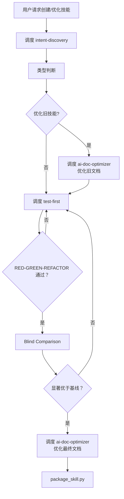
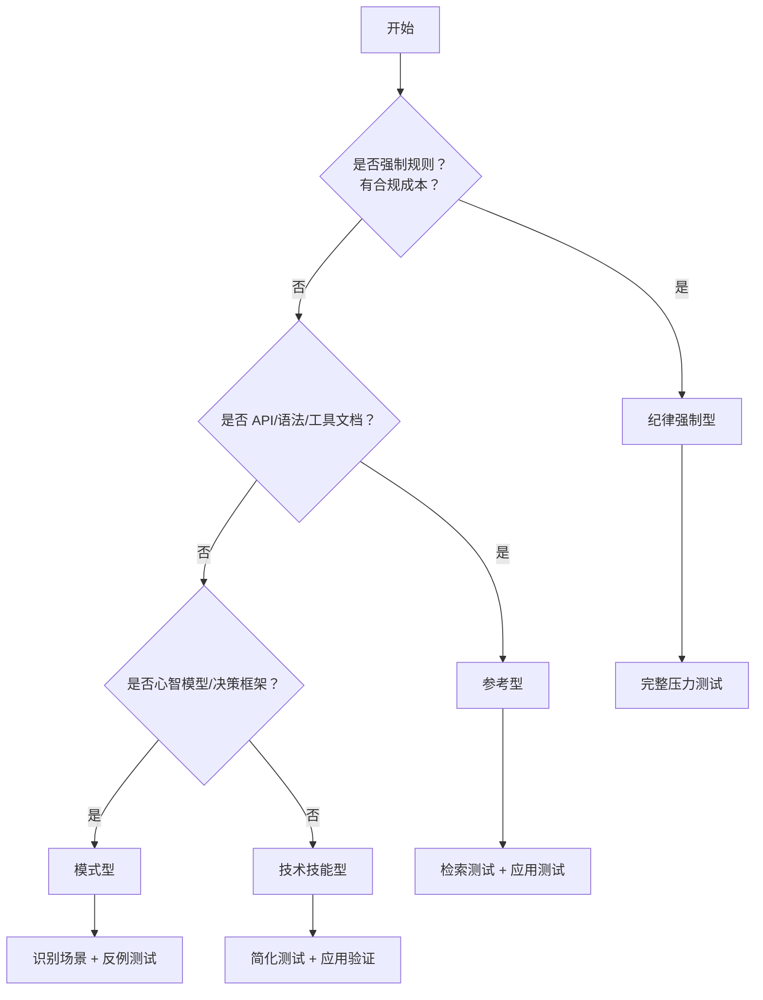
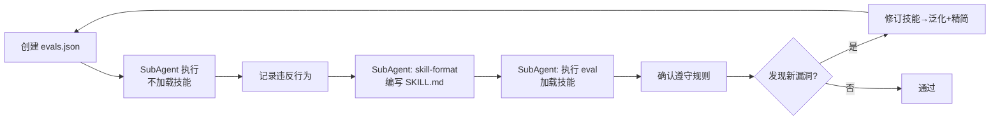
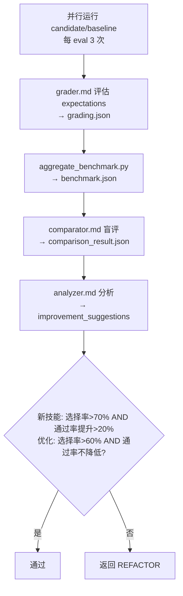

# Meta Skill

## Overview

编排技能创建/更新流程。**纯调度，不执行**：不直接读写文件、不运行测试、不编写代码；仅调用 SubAgent/技能/脚本。

**输入**: 模糊想法（创建）/ 现有技能 + 改进需求（更新）  
**输出**: 打包好的 `.skill` 文件

**铁律**: `NO SKILL WITHOUT A FAILING TEST FIRST`（没有例外）

**硬性限制**:
| 限制 | 数值 |
|------|------|
| TDD 循环 | 最多 5 次 |
| Blind Comparison | 最多 3 轮 |

---

## Terminology

| 术语 | 定义 |
|------|------|
| TDD | 测试驱动开发：RED→GREEN→REFACTOR |
| RED | 编写测试→SubAgent 执行失败 |
| GREEN | 编写实现→SubAgent 执行通过 |
| REFACTOR | 修订技能→泛化+精简→保持通过 |
| Blind Comparison | 盲比较：评估者不知 candidate/baseline 身份 |
| candidate | 待验证的技能版本（新技能或优化后版本） |
| baseline | 对比基准（新技能=无技能；优化=旧版本） |
| 显著优于基线 | 新技能：选择率>70% AND 通过率提升>20%；优化：选择率>60% AND 通过率不降低 |
| SubAgent | 通过 Cursor Task 或 subprocess 启动的独立 Agent |

---

## Core Pattern



---

## Implementation

### 阶段 1: 意图捕捉

**调度**: [必须] 技能 `intent-discovery`，渐进式提问澄清需求

**输出**:
```json
{
  "skill_name": "kebab-case-name",
  "description": "Use when [触发条件]",
  "language": "zh-CN | en-US",
  "output_dir": "~/.qwen/skills/xxx 或 ./skills/xxx",
  "requirements": {"what": "...", "when": "...", "output": "...", "test": "..."},
  "boundaries": {"in_scope": [], "out_of_scope": []},
  "skill_type": "纪律强制型 | 技术技能型 | 模式型 | 参考型"
}
```

### 阶段 2: 技能类型判断

**输出**: 判断技能类型，写入 intent-discovery 的 JSON



| 类型 | 特征 | 测试方法 |
|------|------|----------|
| 纪律强制型 | 强制规则、有合规成本、用户可合理化跳过 | 完整压力测试 |
| 技术技能型 | how-to、工具使用 | 简化测试 + 应用验证 |
| 模式型 | 心智模型、决策框架 | 识别场景 + 反例测试 |
| 参考型 | API/语法/工具文档 | 检索测试 + 应用测试 |

**额外操作**:
| 场景 | 操作 | 原因 |
|------|------|------|
| 纪律强制型 [必须] | 阶段 3 前调度 `anti-rationalization`，将压力场景追加到 `evals.json` | 压力测试 |
| 优化旧技能 [必须] | 阶段 3 前调度 `ai-doc-optimizer`，优化旧技能文档 | 防止 TDD 阶段丢失语义 |

### 阶段 3: TDD 循环（RED-GREEN-REFACTOR）

**调度**: [必须] 技能 `test-first`  
**最大迭代**: 5 次（超过→人工审查）



| 步骤 | 操作 | 调度 |
|------|------|------|
| RED | 创建 evals.json → SubAgent 执行（不加载技能）→ 记录违反行为 | SubAgent |
| GREEN | SubAgent 调度 skill-format 编写 SKILL.md → 执行 eval（加载技能）→ 确认遵守 | SubAgent |
| REFACTOR | 发现新漏洞 → 修订技能 → 泛化+精简 | 无 |

纪律强制型：RED 使用含 `pressure_scenarios` 的 evals.json；GREEN 验证压力场景下仍遵守。

### 阶段 4: Blind Comparison

**对比策略**:
| 场景 | 对比方式 | 基线 |
|------|----------|------|
| 创建新技能 | new-skill vs baseline | baseline=无技能运行 |
| 优化旧技能 | new-skill vs old-skill | old-skill=优化前版本 |

**最大迭代**: 3 轮（每轮：每 eval 用例跑 3 次 candidate + 3 次 baseline）



| 步骤 | 操作 | 调度 |
|------|------|------|
| 1 | SubAgent 并行运行 candidate 和 baseline（每 eval 3 次）| SubAgent |
| 2 | SubAgent 加载 `agents/grader.md`，评估 expectations→grading.json | SubAgent |
| 3 | 执行 `python -m scripts.aggregate_benchmark .test/iteration-N --skill-name <name>` | 脚本 |
| 4 | SubAgent 加载 `agents/comparator.md`，盲评→comparison_result.json | SubAgent |
| 5 | SubAgent 加载 `agents/analyzer.md`，分析→improvement_suggestions | SubAgent |
| 6 | 判断：新技能（选择率>70% AND 通过率提升>20%）/ 优化（选择率>60% AND 通过率不降低）| 无 |

**路径**: `.test/iteration-N/eval-M/{candidate,baseline}/run-K/`  
**指标**: 选择率=comparator 选 candidate 的比例；通过率=grader 断言通过比例  
**失败**: 未通过→返回 REFACTOR（用 improvement_suggestions）→ 只重跑 improvement_suggestions 指定的 eval，未指定则全重跑

### 阶段 5: 文档优化

**调度**: [必须] 技能 `ai-doc-optimizer`  
**收敛标准**: 连续 2 轮语义等价且结构稳定，或 max_iterations=5

| 情况 | 处理 |
|------|------|
| 语义丢失 | 输出 last_valid + 警告 |
| 达上限未收敛 | 输出 last_valid + 未解决问题列表 |

### 阶段 6: 打包部署

```bash
cd <skill-directory>
PYTHONPATH=. python3 scripts/package_skill.py .
```

**输出**: `.skill` 文件

**验证规则**（由 `scripts/quick_validate.py` 执行）:
| 规则 | 要求 |
|------|------|
| 命名 | kebab-case |
| frontmatter | 有效 YAML，description 含冒号需加引号 |
| 行数 | <500 行（硬限制）；≥250 行需渐进式披露（警告） |
| 格式 | Mermaid 流程图（禁止 ASCII），3+ 项用列表/表格 |

---

## Dependencies

| 依赖 | 阶段 | 必须/可选 |
|------|------|----------|
| intent-discovery | 1 | 必须 |
| ai-doc-optimizer | 2（优化旧技能） | 优化旧技能必须 |
| anti-rationalization | 2（纪律强制型） | 纪律强制型必须 |
| test-first | 3 | 必须 |
| skill-format | 3 | 必须 |
| agents/grader.md | 4 步骤 2 | 必须 |
| agents/comparator.md | 4 步骤 4 | 必须 |
| agents/analyzer.md | 4 步骤 5 | 必须 |
| scripts/aggregate_benchmark.py | 4 步骤 3 | 必须 |
| ai-doc-optimizer | 5 | 必须 |
| scripts/package_skill.py | 6 | 必须 |

---

## Anti-Patterns

| 错误 | Red Flag | 反制 |
|------|----------|------|
| 跳过 intent-discovery | "需求很清楚，不需要澄清" | 模糊需求是技能失败的首因 |
| 跳过 RED 阶段 | "这个技能很简单，不需要测试" | 跳过测试=无法证明技能有效 |
| 自己写 SKILL.md，不调度 skill-format | "我知道格式，直接写" | 格式知识可能过时 |
| 跳过 Blind Comparison | "测试通过了，肯定比基线好" | 测试通过≠优于基线 |
| 跳过 ai-doc-optimizer | "文档已经很清晰了" | 优化是必须的收敛过程 |
| TDD 失败后继续 | "再试一次可能就过了" | 必须 REFACTOR，不能重复失败 |
| Blind Comparison 未达标继续 | "70% 太严格了" | 降低标准=降低质量 |
| 自己执行任务 | "这个很快，我直接做" | meta-skill 不执行，只调度 |
| 纪律强制型跳过 anti-rationalization | "压力场景不重要" | 压力下最容易被跳过 |

**核心原则**:
- **纯调度，不执行**: 仅编排流程，不直接执行任务
- **铁律不可破**: NO SKILL WITHOUT A FAILING TEST FIRST（没有例外）
- **必须调度**: 各阶段技能/SubAgent/脚本均须调度，不可跳过
- **迭代上限**: TDD 5 次、Blind Comparison 3 轮，超过→人工审查

---

## Failure Handling

| 类型 | 处理 |
|------|------|
| 可修复 | 按错误信息修复后重试 |
| 需重构 | 返回 REFACTOR |
| 超过迭代上限 | 记录到 `.test/iteration-N/failure.md` → 人工审查 |

**记录内容**: 失败阶段、错误信息、已尝试修复、建议下一步

| 情况 | 处理 |
|------|------|
| 用户拒绝回答 | 基于已有信息继续，标记假设到 boundaries |
| 需求频繁变更 | 确定当前版本→继续→变更作为新迭代 |
| 范围扩大 | 提醒边界→新需求放入 out_of_scope |
| 类型模糊 | 默认技术技能型→REFACTOR 调整 |

---

## Verification

```bash
wc -w skills/meta-skill/SKILL.md
ls skills/meta-skill/agents/ scripts/
```

**清单**: 意图澄清 ✓ / 类型判断 ✓ / TDD 通过 ✓ / Blind Comparison 通过 ✓ / 文档优化 ✓ / 打包 ✓
