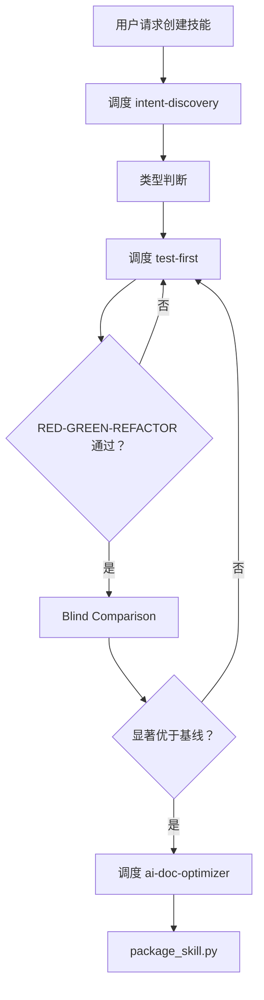
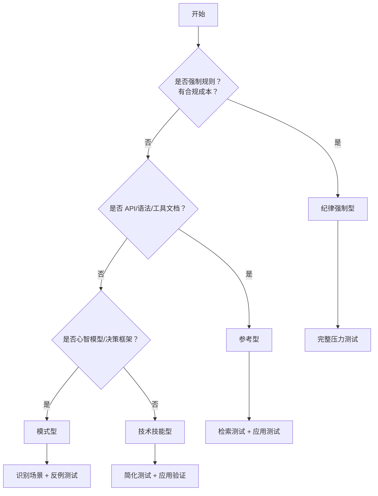
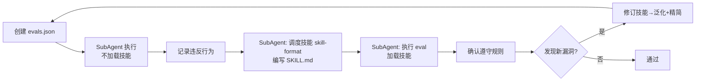
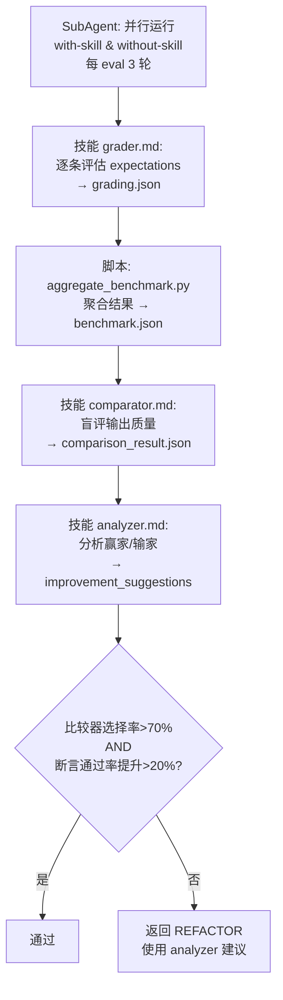

# Meta Skill

## Overview

编排技能创建/更新流程。**纯调度，不执行**。

**输入**: 模糊想法（创建）/ 现有技能 + 改进需求（更新）

**输出**: 打包好的 `.skill` 文件

**铁律**: `NO SKILL WITHOUT A FAILING TEST FIRST`（没有例外）

**调度类型**:
| 类型 | 含义 | 典型用例 |
|------|------|----------|
| **SubAgent** | 启动独立 Agent 执行任务（Cursor Task、Qwen subprocess、Claude Projects 等） | 运行 eval、并行测试、聚合 benchmark |
| **技能** | 让当前 Agent 加载技能文件并遵循规则 | intent-discovery、test-first、skill-format、grader、comparator、analyzer、anti-rationalization、ai-doc-optimizer |
| **脚本** | 执行本地 Python 脚本 | aggregate_benchmark.py、package_skill.py |

**硬性限制**:
- TDD 循环：最多 5 次
- Blind Comparison：最多 3 轮

---

## Terminology

| 术语 | 定义 |
|------|------|
| TDD | 测试驱动开发：RED→GREEN→REFACTOR |
| RED | 编写测试→运行失败 |
| GREEN | 编写实现→运行通过 |
| REFACTOR | 重构优化→保持通过 |
| Blind Comparison | 盲比较：评估者不知哪个是带技能输出 |
| 渐进式提问 | 逐层深入，每轮基于上一轮答案 |
| 完整压力测试 | 覆盖所有压力场景 + 合理化尝试 |
| 简化测试 | 核心功能 + 典型场景 |
| 边界外场景 | 超出 in_scope 的场景 |
| 泛化 | 规则适用于边界外场景 |
| 反例测试 | 验证非目标场景不触发技能 |
| 显著优于基线 | 比较器选择率>70% AND 断言通过率提升>20% |
| 比较器选择率 | winner_is_with_skill=true 次数 / 总比较次数 |
| 断言通过率提升 | (with_skill.pass_rate - without_skill.pass_rate) / without_skill.pass_rate |

---

## Core Pattern



---

## Implementation

### 阶段 1: 意图捕捉

**调度**: [必须] **技能** `intent-discovery`，渐进式提问澄清需求

**确认事项**:
- 技能名称和描述
- 技能语言（与用户输入一致）
- 输出目录：`~/.qwen/` / `~/.claude/` / `~/.cursor/` / `./`
- 需求定义（what/when/output/test）
- 边界（in_scope/out_of_scope）
- 技能类型

**输出**:
```json
{
  "skill_name": "kebab-case-name",
  "description": "Use when [触发条件]",
  "language": "zh-CN | en-US",
  "output_dir": "~/.qwen/skills/xxx 或 ./skills/xxx",
  "requirements": {"what": "...", "when": "...", "output": "...", "test": "..."},
  "boundaries": {"in_scope": [], "out_of_scope": []},
  "skill_type": "纪律强制型 | 技术技能型 | 模式型 | 参考型"
}
```

### 阶段 2: 技能类型判断

**输出**: 判断技能类型，写入 intent-discovery 的 JSON

**决策流程**:


**类型与测试**:
| 类型 | 特征 | 测试方法 |
|------|------|----------|
| 纪律强制型 | 强制规则、有合规成本、用户可合理化跳过 | 完整压力测试 |
| 技术技能型 | how-to、工具使用 | 简化测试 + 应用验证 |
| 模式型 | 心智模型、决策框架 | 识别场景 + 反例测试 |
| 参考型 | API/语法/工具文档 | 检索测试 + 应用测试 |

**纪律强制型额外操作** [必须]: 在阶段 3 前**调度技能** `anti-rationalization`，将压力场景追加到 evals.json（字段 `pressure_scenarios`）

### 阶段 3: TDD 循环（RED-GREEN-REFACTOR）

**调度**: [必须] **技能** `test-first`

**最大迭代次数**: 5 次（超过→人工审查）

**流程**:


| 步骤 | 操作 | 调度 |
|------|------|------|
| RED | [必须] 创建 evals.json→**SubAgent 执行**（不加载技能）→记录违反行为 | **SubAgent** |
| GREEN | [必须] **SubAgent**：调度技能 skill-format 编写 SKILL.md→执行 eval（加载技能）→确认遵守 | **SubAgent**（内部调度技能） |
| REFACTOR | 发现新漏洞→修订技能→泛化 + 精简 | 无 |

纪律强制型：RED 使用含压力场景的 evals.json；GREEN 验证压力场景下仍遵守。

**失败处理**: 5 次迭代后未通过 → 记录到 `.test/iteration-N/failure.md` → 人工审查

### 阶段 4: Blind Comparison

**最大迭代次数**: 3 轮（每轮 3 次运行）

**流程**:


| 步骤 | 操作 | 调度 |
|------|------|------|
| 1 | [必须] **SubAgent** 并行运行 with-skill 和 without-skill（每 eval 3 轮）| **SubAgent** |
| 2 | [必须] **技能** grader.md 逐条评估 expectations→grading.json | **技能** |
| 3 | [必须] 执行 `python -m scripts.aggregate_benchmark .test/iteration-N --skill-name <name>` | **脚本** |
| 4 | [必须] **技能** comparator.md 盲评两个输出（隐藏配置，匿名化 output_A/B）| **技能** |
| 5 | [必须] **技能** analyzer.md 分析赢家/输家→improvement_suggestions | **技能** |
| 6 | [必须] 判断：比较器选择率>70% AND 断言通过率提升>20% | 无 |

目录结构：`.test/iteration-N/eval-M/{with_skill,without_skill}/run-K/`

**失败处理**:
- 未通过 → 返回 REFACTOR（用 analyzer 建议）→ 增量验证：只重跑 improvement_suggestions 指定的 eval，未指定则重跑全部
- 3 轮后未通过 → 记录到 `.test/iteration-N/failure.md` → 人工审查

### 阶段 5: 文档优化

**调度**: [必须] **技能** `ai-doc-optimizer`

**收敛标准**: 连续 2 轮语义等价且结构稳定，或 max_iterations=5

**失败处理**:
- 语义丢失 → 输出 last_valid + 警告
- 达上限未收敛 → 输出 last_valid + 未解决问题列表

### 阶段 6: 打包部署

```bash
cd <skill-directory>
PYTHONPATH=. python3 scripts/package_skill.py .
```

**输出**: `.skill` 文件

**验证规则**:
| 规则 | 要求 |
|------|------|
| 命名 | kebab-case |
| frontmatter | 有效 YAML，description 含冒号需加引号 |
| 字数 | <3000 字；≥300 字需渐进式披露 |
| 格式 | Mermaid 流程图（禁止 ASCII），3+ 项用列表/表格 |

**常见错误**:
| 错误 | 修复 |
|------|------|
| `ModuleNotFoundError: No module named 'scripts'` | 添加 `PYTHONPATH=.` |
| `Invalid YAML in frontmatter` | description 冒号加引号 |
| `SKILL.md not found` | 确认目录含 SKILL.md |

---

## Data Formats

| 文件 | 生产者 | 消费者 |
|------|--------|--------|
| grading.json | grader.md | aggregate_benchmark.py |
| benchmark.json | aggregate_benchmark.py | analyzer.md |
| comparison_result.json | comparator.md | 判断逻辑 |
| analysis_result.json | analyzer.md | REFACTOR |

详细格式见 `docs/*.md`

---

## Dependencies

- `intent-discovery` — 阶段 1
- `test-first` — 阶段 3
- `anti-rationalization` — 阶段 3（纪律强制型）
- `skill-format` — 阶段 3
- `agents/grader.md` — 阶段 4 步骤 2
- `agents/comparator.md` — 阶段 4 步骤 4
- `agents/analyzer.md` — 阶段 4 步骤 5
- `scripts/aggregate_benchmark.py` — 阶段 4 步骤 3
- `ai-doc-optimizer` — 阶段 5
- `scripts/package_skill.py` — 阶段 6

---

## Failure Handling

| 类型 | 处理 |
|------|------|
| 可修复 | 按错误信息修复后重试 |
| 需重构 | 返回 REFACTOR |
| 不可修复 | 记录→人工审查 |

**回滚**: 失败时回滚到上一通过版本，记录到 `.test/iteration-N/failure.md`（含失败阶段、错误、已尝试修复、建议下一步）

**边界**:
| 情况 | 处理 |
|------|------|
| 用户拒绝回答 | 基于已有信息继续，标记假设到 boundaries |
| 需求频繁变更 | 确定当前版本→继续→变更作为新迭代 |
| 范围扩大 | 提醒边界→新需求放入 out_of_scope |
| 类型模糊 | 默认技术技能型→REFACTOR 调整 |

---

## Verification

```bash
wc -w skills/meta-skill/SKILL.md
ls skills/meta-skill/agents/ scripts/
```

**清单**: 意图澄清 ✓ / 类型判断 ✓ / TDD 通过 ✓ / Blind Comparison 通过 ✓ / 文档优化 ✓ / 打包 ✓
