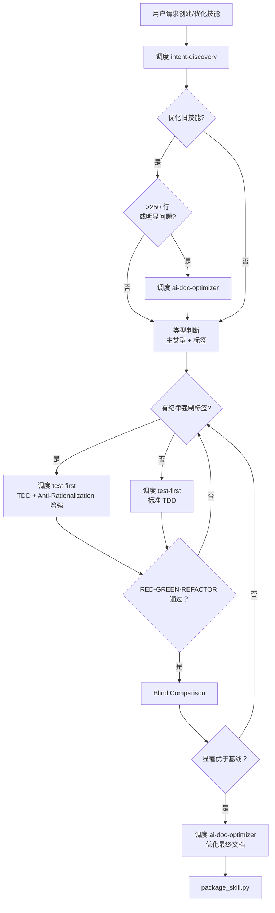
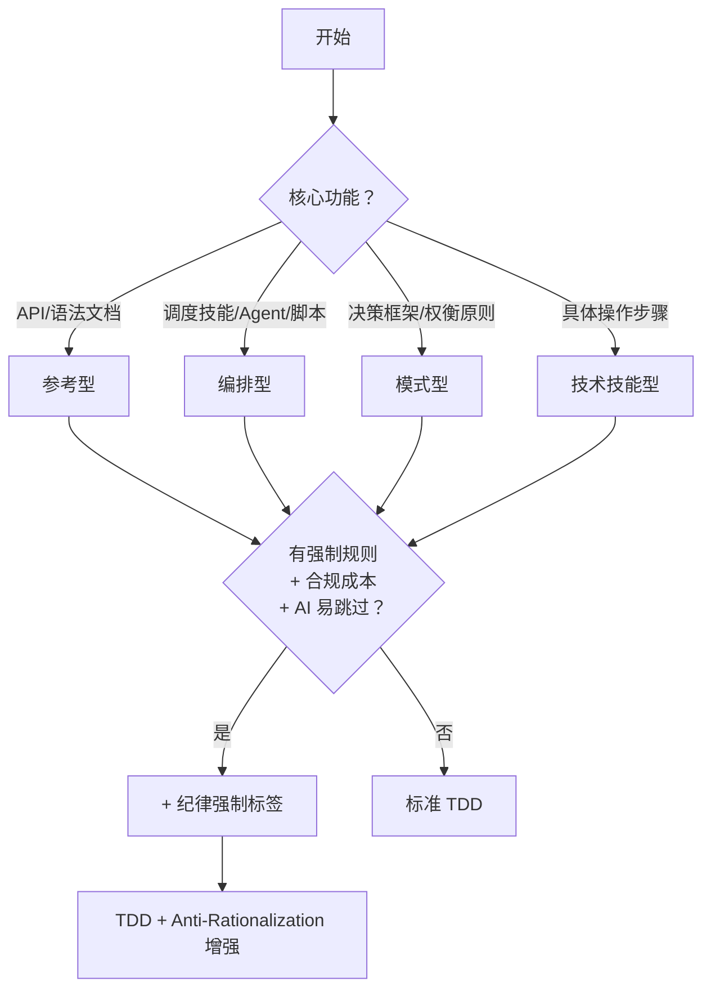
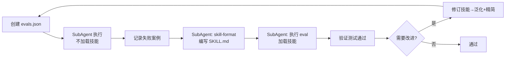
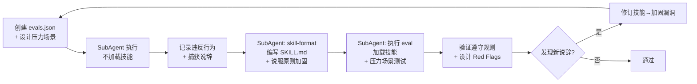
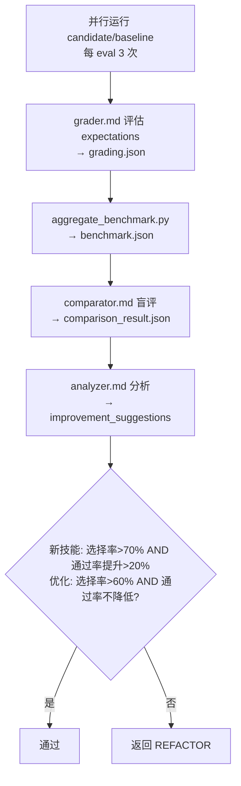

# Meta Skill

## Overview

编排技能创建/更新流程。**纯调度，不执行**：不直接读写文件、不运行测试、不编写代码；仅调用 SubAgent/技能/脚本。

**输入**: 模糊想法（创建）/ 现有技能 + 改进需求（更新）  
**输出**: 打包好的 `.skill` 文件

**铁律**: `NO SKILL WITHOUT A FAILING TEST FIRST`（没有例外）

**硬性限制**:
| 限制 | 数值 |
|------|------|
| TDD 循环 | 最多 5 次 |
| Blind Comparison | 最多 3 轮 |

---

## Terminology

| 术语 | 定义 |
|------|------|
| TDD | 测试驱动开发：RED→GREEN→REFACTOR |
| RED | 编写测试→SubAgent 执行失败 |
| GREEN | 编写实现→SubAgent 执行通过 |
| REFACTOR | 修订技能→泛化+精简→保持通过 |
| Blind Comparison | 盲比较：评估者不知 candidate/baseline 身份 |
| candidate | 待验证的技能版本（新技能或优化后版本） |
| baseline | 对比基准（新技能=无技能；优化=旧版本） |
| 显著优于基线 | 新技能：选择率>70% AND 通过率提升>20%；优化：选择率>60% AND 通过率不降低 |
| SubAgent | 通过 Cursor Task 或 subprocess 启动的独立 Agent |
| evals.json | 评估用例配置，含 eval 用例列表；有纪律强制标签时另含 pressure_scenarios |
| 返回 REFACTOR | 返回阶段 3 继续 TDD 循环 |
| improvement_suggestions | analyzer.md 输出；指明 eval 时仅重跑该部分，否则全重跑 |
| 主类型 | 技能的核心功能分类：参考型、编排型、模式型、技术技能型 |
| 纪律强制标签 | 可叠加到任何主类型的属性：有强制规则 + 合规成本 + AI 易跳过 |
| 说辞 | rationalization=AI 用于合理化跳过规则的表述 |
| 压力叠加 | 多种压力同时作用，如时间紧+需求简单+SubAgent 失败；≥3 种 |
| 改进需求 | 优化旧技能时：用户提出的优化方向或问题描述 |
| 明显问题 | 歧义、冗余、结构混乱（任一即触发前置优化） |

---

## Core Pattern



---

## Implementation

**阶段速览**:
| 阶段 | 调度 | 输出 |
|------|------|------|
| 1 意图捕捉 | intent-discovery | requirements、context |
| 2 类型判断 | 无（本阶段判断） | skill_type（主类型+标签） |
| 3 TDD | test-first、skill-format | SKILL.md、evals、通过 |
| 4 盲比较 | grader、comparator、analyzer、aggregate_benchmark | 显著优于基线 |
| 5 文档优化 | ai-doc-optimizer | 收敛文档 |
| 6 打包 | package_skill.py | .skill 文件 |

### 阶段 1: 意图捕捉

**调度**: [必须] 技能 `intent-discovery`，渐进式提问澄清需求

**meta-skill 调用时传递**:
- `requirement_type`: "skill-creation"（固定）
- `context`: `{"language": "zh-CN | en-US", "output_dir": "~/.qwen/skills/xxx 或 ./skills/xxx"}`

**intent-discovery 输出**:
```json
{
  "requirement_type": "skill-creation",
  "requirements": {"what": "...", "when": "...", "output": "...", "test": "..."},
  "boundaries": {"in_scope": [], "out_of_scope": []},
  "dependencies": [],
  "constraints": [],
  "context": {
    "skill_name": "kebab-case-name",
    "description": "Use when [触发条件]",
    "language": "zh-CN | en-US",
    "output_dir": "~/.qwen/skills/xxx 或 ./skills/xxx"
  },
  "next_steps": []
}
```

**meta-skill 提取**:
- `skill_name`: 从 `context.skill_name`
- `description`: 从 `context.description`
- `language`: 从 `context.language`
- `output_dir`: 从 `context.output_dir`
- `skill_type`: 在阶段 2 判断

**优化旧技能的前置处理**（在阶段 2 之前）:

| 场景 | 条件 | 操作 | 原因 |
|------|------|------|------|
| 优化旧技能 | >250 行 OR 存在明显问题 | 调度 `ai-doc-optimizer`，再进入阶段 2 | 防止 TDD 阶段丢失语义 |
| 优化旧技能 | ≤250 行 AND 无明显问题 | 跳过前置优化，直接进入阶段 2 | 避免不必要开销 |
| 创建新技能 | N/A | 直接进入阶段 2 | 无旧文档需要优化 |

### 阶段 2: 技能类型判断

**输入**: 阶段 1 的 intent-discovery 输出  
**输出**: 判断 `skill_type`（主类型 + 纪律强制标签），添加到 context 中

**判断流程**（两步）:



**主类型定义**:

| 主类型 | 核心问题 | 特征 | 例子 |
|--------|---------|------|------|
| 参考型 | "语法/API 是什么？" | 文档、速查表、配置说明 | Git 命令参考、API 文档 |
| 编排型 | "调度谁？按什么顺序？" | 调度其他技能/Agent/脚本 | **Meta-Skill**、CI/CD 流程 |
| 模式型 | "怎么选？如何权衡？" | 决策框架、判断标准、权衡原则 | 架构设计原则、测试策略 |
| 技术技能型 | "怎么做？具体步骤？" | 操作步骤、工具使用 | 配置 Git、部署应用 |

**纪律强制标签**（可叠加到任何主类型）:

| 判断标准 | 说明 | 例子 |
|---------|------|------|
| 有强制规则 | 明确的"必须"或"禁止" | "必须先写测试"、"禁止跳过澄清" |
| 有合规成本 | 遵守规则需要额外工作量 | 调度 SubAgent 比自己写慢 |
| AI 易合理化跳过 | AI 容易找借口不遵守 | "这个很简单，不需要测试" |

**TDD 模式映射**:

| 主类型 + 标签 | TDD 模式 | 说明 |
|--------------|---------|------|
| 任意主类型 + 纪律强制标签 | TDD + Anti-Rationalization 增强 | RED/GREEN/REFACTOR 各阶段融入压力测试、说辞捕获、漏洞封堵 |
| 任意主类型（无标签） | 标准 TDD | 按 test-first 标准流程执行 |

### 阶段 3: TDD 循环（RED-GREEN-REFACTOR）

**调度**: [必须] 技能 `test-first`  
**最大迭代**: 5 次（超过→人工审查）

**测试产物**（阶段 3-4 通用）: 必须全部置于 `.test/`：
- evals.json、grading.json、benchmark.json、comparison_result.json、improvement_suggestions、failure.md
- 路径：`iteration-N/eval-M/{candidate,baseline}/run-K/`

**模式选择**: 按阶段 2 的 TDD 模式映射执行（有纪律强制标签→增强；无→标准）

#### 标准 TDD 流程

适用于技术技能型、模式型、参考型。



| 步骤 | 操作 | 调度 | 输出 |
|------|------|------|------|
| RED | 创建 evals.json → SubAgent 执行（不加载技能）→ 记录失败案例 | SubAgent | evals.json<br/>失败案例记录 |
| GREEN | SubAgent 调度 skill-format 编写 SKILL.md → 执行 eval（加载技能）→ 验证测试通过 | SubAgent | SKILL.md（标准章节） |
| REFACTOR | 需要改进 → 修订技能 → 泛化+精简 | 无 | 优化后的 SKILL.md |

#### Anti-Rationalization 增强（有纪律强制标签）

仅适用于有纪律强制标签的技能。在标准 TDD 基础上，各阶段增加 anti-rationalization 策略：



| 步骤 | 标准 TDD | Anti-Rationalization 增强 | 输出 |
|------|---------|--------------------------|------|
| RED | 创建 evals.json<br/>记录失败案例 | + 设计压力场景（见术语：压力叠加）<br/>+ 对抗测试捕获说辞（逐字记录） | evals.json 含 pressure_scenarios<br/>说辞记录（逐字） |
| GREEN | 编写 SKILL.md<br/>验证测试通过 | + 说服原则加固（权威+承诺+社会证明）<br/>+ 漏洞封堵（No exceptions + 逐一禁止）<br/>+ 设计 Red Flags 和 Anti-Patterns | SKILL.md 含：<br/>- 标准章节<br/>- 纪律执行章节（Red Flags 表格）<br/>- Anti-Patterns 章节 |
| REFACTOR | 需要改进<br/>修订技能 | + 重测验证（压力场景下）<br/>+ 发现新说辞 → 继续加固 | 迭代直到无新说辞 |

**参考**: anti-rationalization 技能提供完整的 5 阶段策略（设计压力场景 → 捕获说辞 → 说服原则加固 → 漏洞封堵 → 重测验证），在 TDD 流程中按需应用。

### 阶段 4: Blind Comparison

**对比策略**:
| 场景 | 对比方式 | 基线 |
|------|----------|------|
| 创建新技能 | new-skill vs baseline | baseline=无技能运行 |
| 优化旧技能 | new-skill vs old-skill | old-skill=优化前版本 |

**最大迭代**: 3 轮（每轮：每 eval 用例跑 3 次 candidate + 3 次 baseline）



| 步骤 | 操作 | 调度 |
|------|------|------|
| 1 | SubAgent 并行运行 candidate 和 baseline（每 eval 3 次）| SubAgent |
| 2 | SubAgent 加载 `agents/grader.md`，评估 expectations→grading.json | SubAgent |
| 3 | 执行 `python -m scripts.aggregate_benchmark .test/iteration-N --skill-name <name>` | 脚本 |
| 4 | SubAgent 加载 `agents/comparator.md`，盲评→comparison_result.json | SubAgent |
| 5 | SubAgent 加载 `agents/analyzer.md`，分析→improvement_suggestions | SubAgent |
| 6 | 判断：新技能（选择率>70% AND 通过率提升>20%）/ 优化（选择率>60% AND 通过率不降低）| 无 |

**路径**: `.test/iteration-N/eval-M/{candidate,baseline}/run-K/`（N=迭代编号，M=eval 编号，K=run 编号）  
**指标**: 选择率=comparator 选 candidate 的比例；通过率=grader 断言通过比例  
**失败**: 未通过→返回 REFACTOR（用 improvement_suggestions）→ 重跑范围见术语 improvement_suggestions

### 阶段 5: 文档优化

**调度**: [必须] 技能 `ai-doc-optimizer`  
**收敛标准**: 连续 2 轮语义等价且结构稳定，或 max_iterations=5

| 情况 | 处理 |
|------|------|
| 语义丢失 | 输出 last_valid + 警告 |
| 达上限未收敛 | 输出 last_valid + 未解决问题列表 |

### 阶段 6: 打包部署

```bash
python3 scripts/package_skill.py .
```

**输出**: `.skill` 文件

**验证规则**（由 `scripts/quick_validate.py` 执行）:
| 规则 | 要求 |
|------|------|
| 命名 | kebab-case |
| frontmatter | 有效 YAML，description 含冒号需加引号 |
| 行数 | <500 行（硬限制）；≥250 行需渐进式披露（警告） |
| 格式 | Mermaid 流程图（禁止 ASCII），3+ 项用列表/表格 |

---

## Dependencies

| 依赖 | 阶段 | 必须/可选 |
|------|------|----------|
| intent-discovery | 1 | 必须 |
| ai-doc-optimizer | 2（优化旧技能） | 优化旧技能必须 |
| test-first | 3 | 必须 |
| skill-format | 3 | 必须 |
| anti-rationalization | 3（有纪律强制标签） | 参考（策略融入 TDD） |
| agents/grader.md | 4 步骤 2 | 必须 |
| agents/comparator.md | 4 步骤 4 | 必须 |
| agents/analyzer.md | 4 步骤 5 | 必须 |
| scripts/aggregate_benchmark.py | 4 步骤 3 | 必须 |
| ai-doc-optimizer | 5 | 必须 |
| scripts/package_skill.py | 6 | 必须 |

---

## Anti-Patterns

| 错误 | Red Flag | 反制 |
|------|----------|------|
| 跳过 intent-discovery | "需求很清楚，不需要澄清" | 模糊需求是技能失败的首因 |
| 跳过 RED 阶段 | "这个技能很简单，不需要测试" | 跳过测试=无法证明技能有效 |
| 自己写 SKILL.md，不调度 skill-format | "我知道格式，直接写" | 格式知识可能过时 |
| 跳过 Blind Comparison | "测试通过了，肯定比基线好" | 测试通过≠优于基线 |
| 跳过 ai-doc-optimizer | "文档已经很清晰了" | 优化是必须的收敛过程 |
| TDD 失败后继续 | "再试一次可能就过了" | 必须 REFACTOR，不能重复失败 |
| Blind Comparison 未达标继续 | "70% 太严格了" | 降低标准=降低质量 |
| 自己执行任务 | "这个很快，我直接做" | meta-skill 不执行，只调度 |
| 有纪律强制标签但未应用增强策略 | "压力场景不重要" | 有标签时 TDD 各阶段必须融入压力测试、说辞捕获、漏洞封堵 |

**核心原则**: 见 Overview + 硬性限制；各阶段技能/SubAgent/脚本均须调度，不可跳过。

---

## Failure Handling

| 类型/情况 | 处理 |
|-----------|------|
| 可修复 | 按错误信息修复后重试 |
| 需重构 | 返回 REFACTOR |
| 超过迭代上限 | 记录 `.test/iteration-N/failure.md`（失败阶段、错误信息、已尝试修复、建议下一步）→ 人工审查 |
| 用户拒绝回答 | 基于已有信息继续，标记假设到 boundaries |
| 需求频繁变更 | 确定当前版本→继续→变更作为新迭代 |
| 范围扩大 | 提醒边界→新需求放入 out_of_scope |
| 类型模糊 | 默认技术技能型→REFACTOR 调整 |

---

## Verification

```bash
wc -w skills/meta-skill/SKILL.md
ls skills/meta-skill/agents/ scripts/
```

**清单**: 意图澄清 ✓ / 类型判断 ✓ / TDD 通过 ✓ / Blind Comparison 通过 ✓ / 文档优化 ✓ / 打包 ✓
