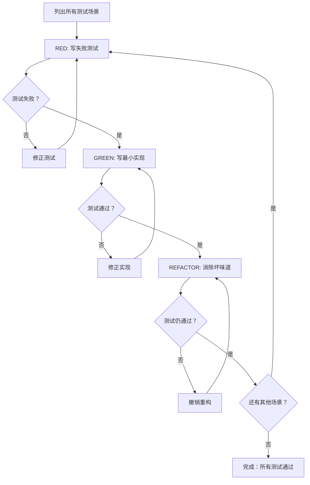

# Test-First (TDD)

## 核心原则

测试驱动开发：**先定义成功标准 → 再执行 → 最后优化**。

**铁律**: `NO TEST WITHOUT FAIL` `NO CODE WITHOUT TEST` `NO EXCEPTIONS`

**适用领域**:

| 领域 | 测试形式 | 实现形式 |
|------|----------|----------|
| 代码 | 单元测试/集成测试 | 实现代码 |
| 文档 | 验收清单/读者测试 | 文档内容 |
| 配置 | 验证脚本/健康检查 | 配置文件 |
| API 设计 | 调用示例/契约测试 | API 规范 |
| 数据处理 | 质量检查/抽样验证 | ETL 脚本 |

**不适用**: 一次性草稿、探索性原型、紧急热修复（需事后补验证）

---

## 开始前三问

1. **测试是什么？** → 用什么证明"做好了"？
2. **最小场景？** → 最简单的可测试单元是什么？
3. **如何失败？** → 测试在什么情况下应该失败？

---

## RED-GREEN-REFACTOR 循环



**关键规则**:
- 每个循环只处理**一个测试场景**
- REFACTOR 后回到 RED 继续下一个场景，直到所有测试通过

### 各阶段详解

| 阶段 | 目标 | 完成标志 | 核心原则 |
|------|------|----------|----------|
| **RED** | 写失败测试 | 测试可执行且会失败 | 最小可测试单元、独立验证、可复现、行为导向 |
| **GREEN** | 写最小实现 | 测试刚好通过 | 仅满足当前测试，不添加额外功能 |
| **REFACTOR** | 消除坏味道 | 测试保持通过且产物改善 | 每次≤5 处改动、每步后运行测试、失败则撤销 |

### RED 阶段验证决策表

| 测试结果 | 原因 | 行动 |
|----------|------|------|
| 测试通过 | 测试逻辑错误/实现已存在 | 修正测试或添加新场景 |
| 编译/语法失败 | 测试本身有错误 | 修正测试语法 |
| 测试失败 | 符合预期 | 进入 GREEN 阶段 |

### GREEN 阶段允许的做法

| 领域 | 允许的做法 |
|------|------------|
| 代码 | 硬编码返回值 |
| 文档 | 使用模板/示例填充 |
| 配置 | 最小权限配置 |
| API | 返回固定响应 |

**关键**: 实现可以"丑"，但测试必须通过

### 各领域坏味道

| 领域 | 坏味道 | 判定标准 |
|------|--------|----------|
| 代码 | 重复代码 | 相同逻辑出现≥2 次 |
| 代码 | 过长函数 | >20 行 |
| 文档 | 信息缺失 | 读者需要追问才能理解 |
| 文档 | 示例不可运行 | 复制粘贴后报错 |
| 配置 | 硬编码敏感信息 | 密码/密钥明文存储 |
| API | 不一致命名 | `/users` 和 `/GetPosts` 混用 |

---

## 纪律执行：处理合理化说辞

**触发条件**:
- 创建任何需要验证的工作产物
- 直接开始实现、跳过验证步骤
- "太简单不用测"、"先做再补"、"应该没问题"式交付

**当遇到合理化说辞时，调度 `anti-rationalization`**:
1. 记录说辞原文（逐字，非概括）
2. 转化为 Red Flag
3. 加固规则（使用权威 + 承诺 + 社会证明原则）

### Red Flags 与应对

| 说辞 | 类型 | 正确做法 |
|------|------|----------|
| 🚩 "先实现再补测试" / "明天补" | 延迟型 | 停止实现，先写测试 |
| 🚩 "太简单不用测" / "就几行代码" | 简化型 | 越简单越容易回归 |
| 🚩 "应该务实不是教条" / "现实要灵活" | 务实型 | 测试是底线不是教条 |
| 🚩 "我是专家不需要" | 专家型 | 专家也会犯错 |
| 🚩 "没时间写测试" / "紧急热修复" | 紧急型 | 没时间 = 更需测试防回滚 |
| 🚩 "这次特殊情况" | - | 没有例外 |
| 🚩 "我手动测过了" | - | 手动检查不可复现 |
| 🚩 "REFACTOR 完就结束了" | - | REFACTOR 后回到 RED 继续下一个测试 |

**处理方式**: 出现上述说辞 → 暂停 → 重申铁律 → 回到 RED 阶段 → 记录说辞并调度 `anti-rationalization`

---

## 部署前检查清单

- [ ] 列出所有测试场景
- [ ] 每个场景都经历 RED-GREEN-REFACTOR 循环
- [ ] 每个测试都先失败（RED）
- [ ] 每个测试失败原因正确（功能缺失，非 typo）
- [ ] 最小实现通过测试（GREEN）
- [ ] 坏味道已消除（REFACTOR）
- [ ] 所有测试场景通过
- [ ] 测试使用真实代码（mock 仅在不可避免时）
- [ ] 边界情况和错误已覆盖
- [ ] 说辞已记录并分类（与 anti-rationalization 一致）
- [ ] Red Flags 已更新

---

## 验证命令

```bash
wc -w skills/test-first/SKILL.md
cat evals.json | jq '.evals | length'
# 代码：pytest tests/
# 文档：检查验收清单
# 配置：./verify-config.sh
# API: 运行契约测试
# 数据：运行质量检查
```

---

## 影响对比

| 指标 | 无 TDD | 有 TDD |
|------|--------|--------|
| Bug 率 | 高 | 低 |
| 回归 | 频繁 | 罕见 |
| 代码质量 | 不稳定 | 稳定 |
| 文档质量 | 模糊 | 可验证 |
